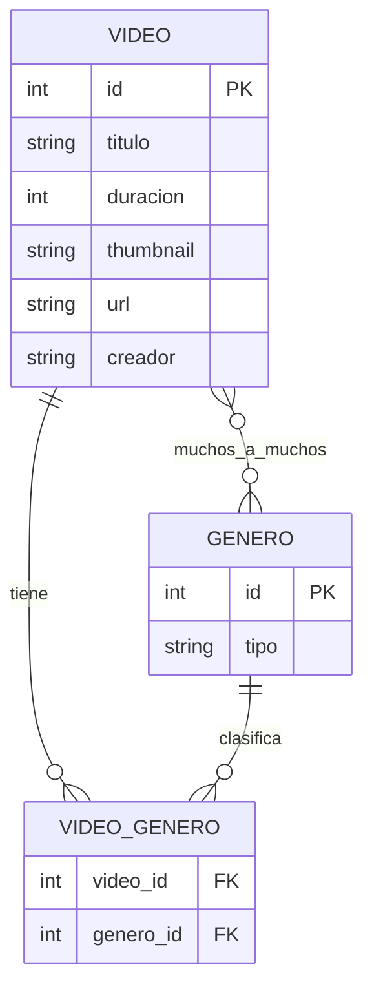
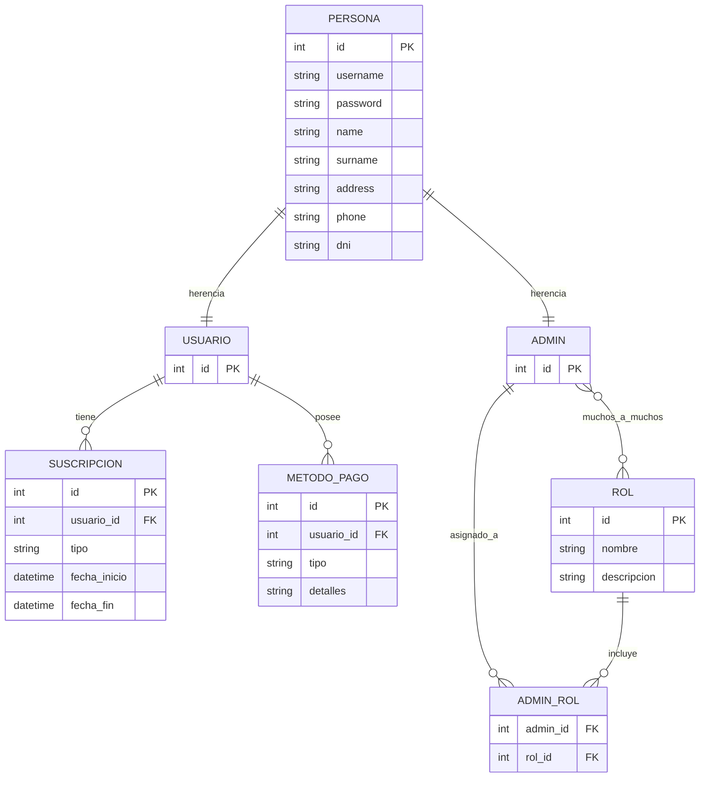

# Diagramas Entidad Relación

## Catálogo de contenidos

```mermaid
erDiagram
    VIDEO {
        int id PK
        string titulo
        int duracion
        string thumbnail
        string url
        string creador
    }

    GENERO {
        int id PK
        string tipo
    }

    VIDEO_GENERO {
        int video_id FK
        int genero_id FK
    }

    VIDEO ||--o{ VIDEO_GENERO : "tiene"
    GENERO ||--o{ VIDEO_GENERO : "clasifica"
    VIDEO }o--o{ GENERO : "muchos_a_muchos"
```

## Suscripciones

```mermaid
erDiagram
    PERSONA {
        int id PK
        string username
        string password
        string name
        string surname
        string address
        string phone
        string dni
    }

    ADMIN {
        int id PK
    }

    USUARIO {
        int id PK
    }

    SUSCRIPCION {
        int id PK
        int usuario_id FK
        string tipo
        datetime fecha_inicio
        datetime fecha_fin
    }

    METODO_PAGO {
        int id PK
        int usuario_id FK
        string tipo
        string detalles
    }

    ROL {
        int id PK
        string nombre
        string descripcion
    }

    ADMIN_ROL {
        int admin_id FK
        int rol_id FK
    }

    PERSONA ||--|| ADMIN : "herencia"
    PERSONA ||--|| USUARIO : "herencia"

    USUARIO ||--o{ SUSCRIPCION : "tiene"
    USUARIO ||--o{ METODO_PAGO : "posee"

    ADMIN ||--o{ ADMIN_ROL : "asignado_a"
    ROL ||--o{ ADMIN_ROL : "incluye"
    ADMIN }o--o{ ROL : "muchos_a_muchos"
```