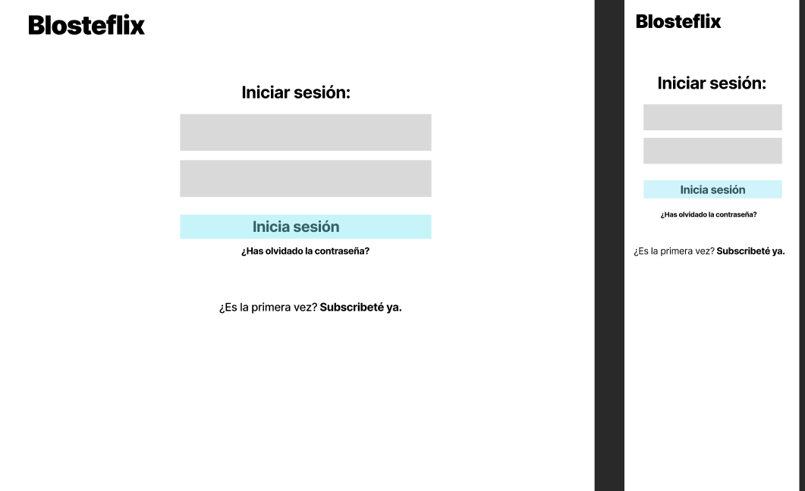
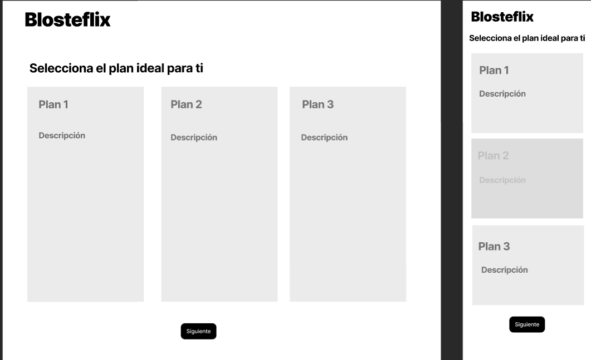

## App client
Vista de catálogo de videos

Al hacer click en el video: se muestran los detalles y muestra la carátula del video para hacer play.

## App admin
Página principal para subir videos

Modificar los metadatos de cada video, confirmar y guardar.

## Portal subscripcions
Página para que el usuario se registre.

Elección de el plan de subscripción

El usuario rellena sus datos personales
