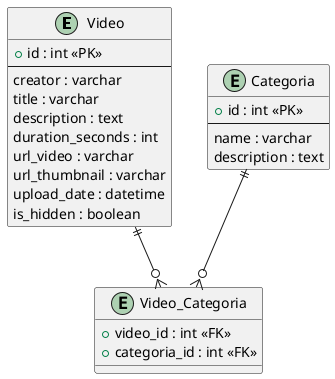
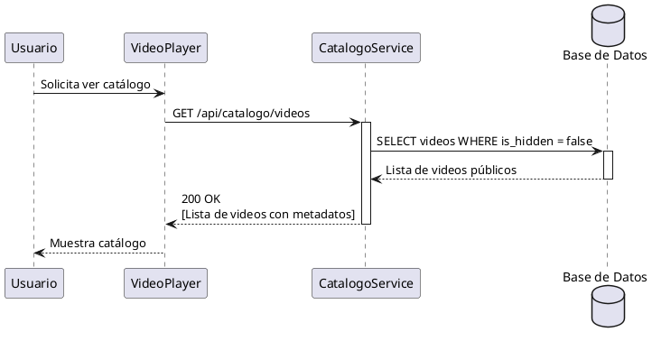
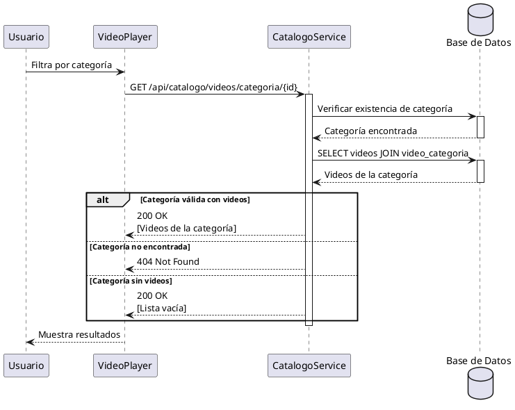
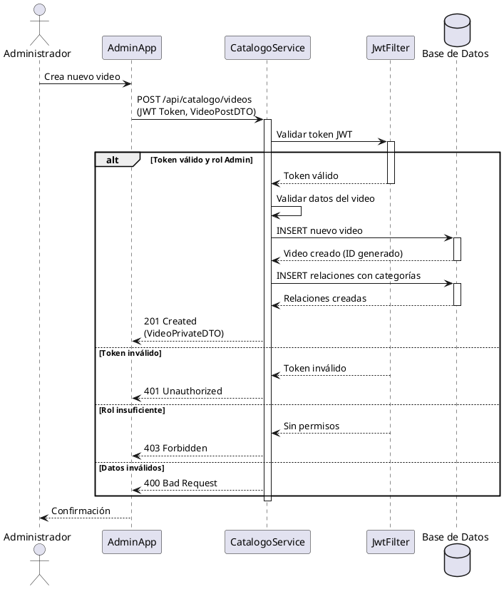
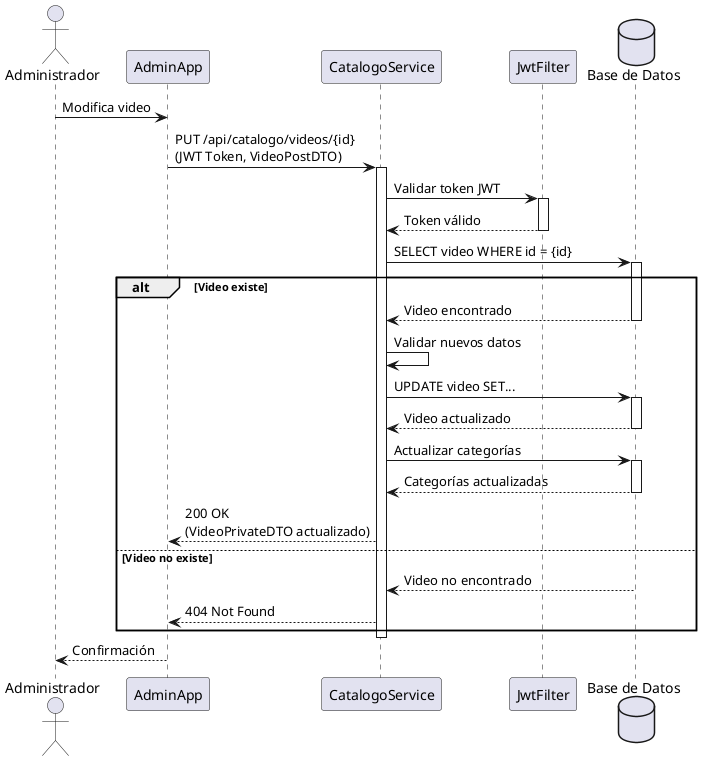
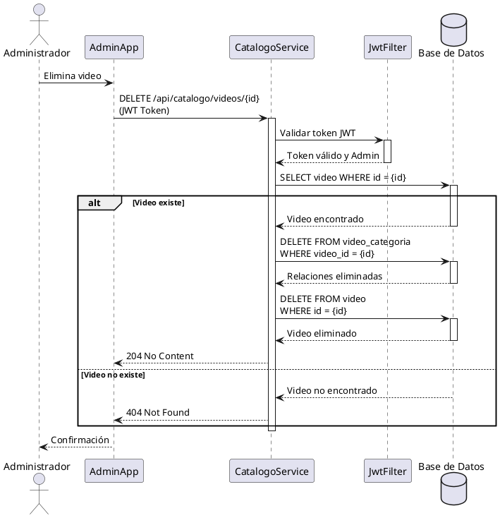
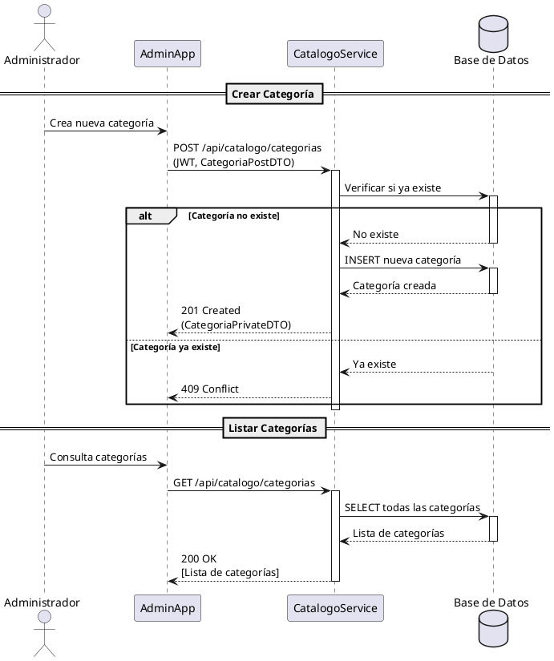

# Documentación del microservicio Catálogo

### Descripción
Microservicio Spring Boot encargado de gestionar el catálogo de videos y categorías de la plataforma. Proporciona una API REST para el almacenamiento, consulta y administración de metadatos de videos y sus clasificaciones por categorías.

### Responsabilidades
+ Gestionar el catálogo completo de videos
+ Administrar categorías de contenido
+ Proporcionar búsqueda y filtrado de videos
+ Gestionar metadatos de videos (título, descripción, miniaturas)
+ Controlar la visibilidad de contenido (videos ocultos)
+ Autenticar y autorizar operaciones mediante JWT

### Interacción
Este componente interactúa con:
+ Administrador de Contenidos (Admin App)
+ Reproductor de Videos (Video Player)
+ Servidor HLS de Videos
+ Gestor de Suscripciones

## Endpoints

### Endpoints GET - Videos

+ `GET /api/catalogo?page={int}&size={int}` : Obtiene el catálogo paginado de videos públicos
+ `GET /api/catalogo/{id}` : Obtiene un video específico por su ID
+ `GET /api/catalogo?categoriaId={int}&page={int}&size={int}` : Obtiene videos de una categoría específica
+ `GET /api/catalogo/search?titulo={titulo}&page={int}&size={int}` : Busca videos por título , paginado

### Endpoints GET - Categorías

+ `GET /api/categorias` : Obtiene todas las categorías disponibles
+ `GET /api/categorias/{id}` : Obtiene una categoría específica por su ID

### Endpoints POST

+ `POST /api/catalogo/videos` : Crea un nuevo video en el catálogo (requiere autenticación de administrador)
+ `POST /api/categorias` : Crea una nueva categoría (requiere autenticación de administrador)

### Endpoints PUT

+ `PUT /api/catalogo/videos/{id}` : Actualiza los datos de un video existente (requiere autenticación de administrador)
+ `PUT /api/categorias/{id}` : Actualiza una categoría existente (requiere autenticación de administrador)

### Endpoints DELETE

Delete videos no se usa porque en su lugar se maneja un campo `is_hidden` para ocultar videos sin eliminarlos físicamente.

+ `DELETE /api/catalogo/videos/{id}` : Elimina un video del catálogo (requiere autenticación de administrador)
+ `DELETE /api/categorias/{id}` : Elimina una categoría (requiere autenticación de administrador)

## Casos de uso

```mermaid
%%{init: {'theme':'base','themeVariables': {'primaryColor':'#0ea5a4','edgeColor':'#065f46','fontFamily':'"Inter", Arial'}} }%%
graph LR
  %% Agrupación de usuarios
  subgraph Usuarios
    direction TB
    U1[🎬 Video Player]
    U3[🛠️ App Admin]
  end

  %% Casos de uso divididos en dos áreas
  subgraph "Casos de uso"
    direction LR
    subgraph "Consulta Pública"
      direction TB
      UC1((🔎 Consultar catálogo completo))
      UC2((📂 Consultar por categoría))
      UC3((🔤 Buscar por título))
      UC4((📋 Listar categorías))
    end

    subgraph "Gestión de Videos"
      direction TB
      UC5((⬆️ Crear video))
      UC6((✏️ Modificar video))
      UC7((🗑️ Eliminar video\n(no usado — soft delete)))
      UC8((👁️ Ocultar/Mostrar video))
    end

    subgraph "Gestión de Categorías"
      direction TB
      UC9((➕ Crear categoría))
      UC10((✏️ Modificar categoría))
      UC11((🗑️ Eliminar categoría))
    end
  end

  %% Relaciones - Consulta (Video Player usa GET)
  U1 -->|GET| UC1
  U1 -->|GET| UC2
  U1 -->|GET| UC3
  U1 -->|GET| UC4

  %% Relaciones - Administración (Admin usa POST/PUT; DELETE raramente por soft delete)
  U3 -->|POST/PUT| UC5
  U3 -->|POST/PUT| UC6
  U3 -->|DELETE (soft)| UC7
  U3 -->|POST/PUT| UC8
  U3 -->|POST/PUT| UC9
  U3 -->|POST/PUT| UC10
  U3 -->|POST/DELETE| UC11

  %% Estilos
  class U1,U3 usernode
  class UC1,UC2,UC3,UC4,UC5,UC6,UC7,UC8,UC9,UC10,UC11 usecase

  classDef usernode fill:#e0f2fe,stroke:#0369a1,stroke-width:2px,rx:8px;
  classDef usecase fill:#ecfccb,stroke:#65a30d,stroke-width:1.5px,rx:20px;
```

## Diagrama Entidad-Relación



## Modelo de datos

### Video
Representa un video en el catálogo con sus metadatos de negocio.

**Campos:**
- `id`: Identificador único del video
- `creator`: Usuario o entidad que creó el video
- `title`: Título del video
- `description`: Descripción detallada del contenido
- `duration_seconds`: Duración del video en segundos
- `url_video`: URL del archivo de video procesado (HLS)
- `url_thumbnail`: URL de la miniatura/thumbnail del video
- `upload_date`: Fecha y hora de subida
- `is_hidden`: Indica si el video está oculto o visible públicamente

### Categoria
Agrupa videos por temática o tipo de contenido.

**Campos:**
- `id`: Identificador único de la categoría
- `name`: Nombre de la categoría
- `description`: Descripción de la categoría

### Video_Categoria
Tabla de relación muchos-a-muchos entre videos y categorías.

**Campos:**
- `video_id`: Referencia al video
- `categoria_id`: Referencia a la categoría

## Diagramas de flujo

### Consultar catálogo de videos



### Buscar videos por categoría



### Crear nuevo video



### Modificar video existente



### Eliminar video



### Gestión de categorías



## Arquitectura y Tecnologías

### Stack Tecnológico
- **Framework**: Spring Boot 3.x
- **Lenguaje**: Java 17+
- **Base de Datos**: MySQL/PostgreSQL (JPA/Hibernate)
- **Seguridad**: Spring Security con JWT
- **API**: RESTful API con Jackson
- **Build**: Maven

### Componentes principales

#### Controllers
- `VideoController`: Gestiona endpoints de videos
- `CategoriaController`: Gestiona endpoints de categorías

#### Services
- `VideoService`: Lógica de negocio para videos
- `CategoriaService`: Lógica de negocio para categorías

#### Repositories
- `VideoRepository`: Acceso a datos de videos (Spring Data JPA)
- `CategoriaRepository`: Acceso a datos de categorías (Spring Data JPA)

#### Security
- `JwtAuthenticationFilter`: Filtro de autenticación JWT
- `JwtTokenProvider`: Generación y validación de tokens
- `SecurityConfig`: Configuración de seguridad
- `CorsConfig`: Configuración de CORS

#### DTOs
- **Public DTOs**: Información expuesta a usuarios no autenticados
- **Private DTOs**: Información completa para administradores
- **Post DTOs**: Datos para creación/actualización de recursos
