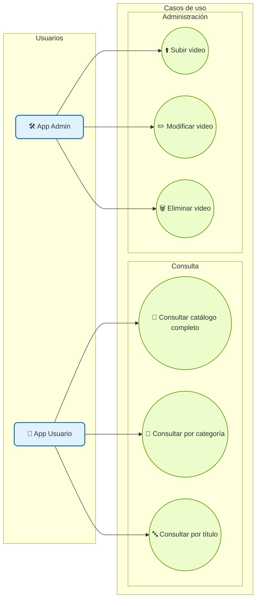
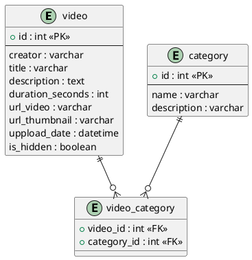

# Backend catálogo

Documentación del backend catálogo.

## Endpoints

### Endpoints GET

+ `api/catalogo` : Recibe todo el catálogo de vídeos
+ `api/catalogo/:id` : Recibe todo el catálogo de vídeos
+ `api/catalogo/:categoria` : Recibe una lista de videos de la categoría especificada
+ `api/catalogo/:titulo` : Recibe un vídeo del título especificado

### Endpoints POST

+ `api/catalogo/:id` : Sube los datos de un video al catálogo

### Endpoints PUT

+ `api/catalogo/:id` : Modifica los datos de un vídeo

## CASOS DE USO

## Diagrama Entidad Relación

