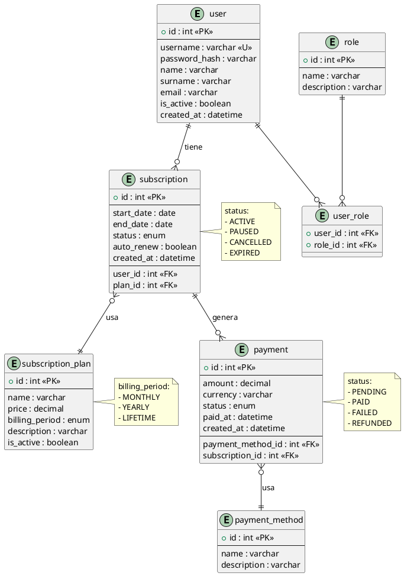
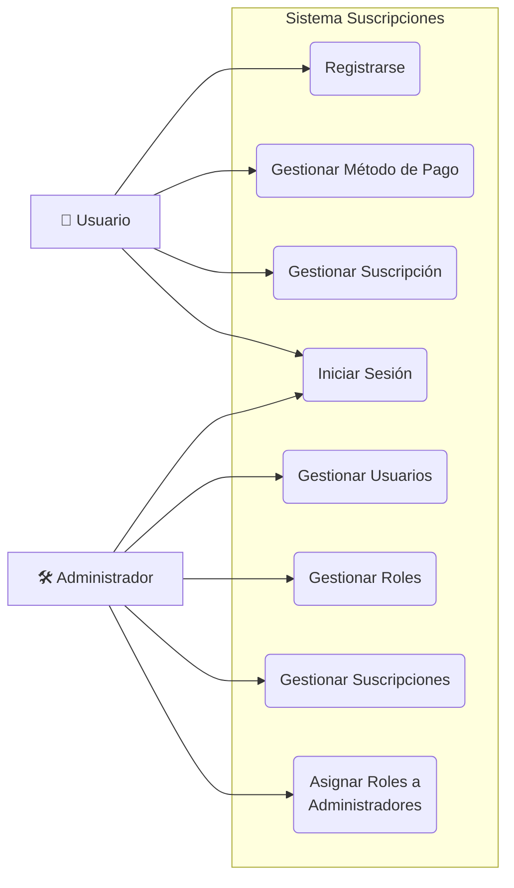
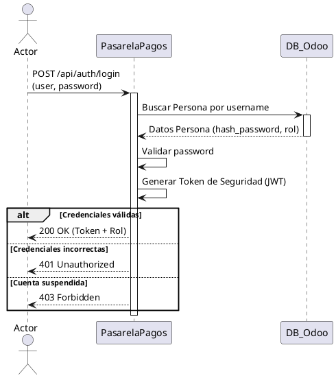
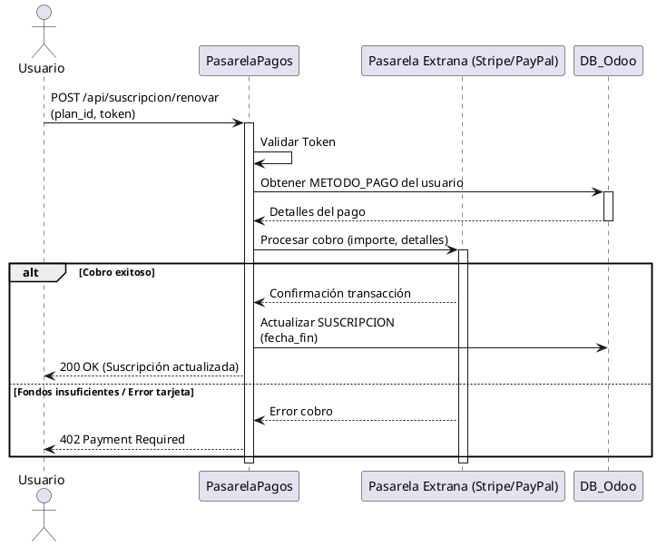

# Pasarela pagos

## Descripción

Servidor de Odoo para gestionar usuarios, suscripciones y metodos de pago.

## Responsabilidades

+ Crear y enviar tokens de seguridad para la interacción entre servicios
+ Gestionar altas, bajas, suspensiones y edición de perfiles
+ Validar métodos de pago y gestionar la información de tarjetas o cuentas asociadas a los usuarios
+ Registrar nuevos usuarios, autenticar credenciales y manejar el inicio de sesión para distintos roles
+ Crear, modificar y renovar planes de suscripción tanto desde la perspectiva del cliente como del administrador

## Interacion

Este componente interactua con:

+ Admin App
+ Video Player
+ Portal web

## Endpoints

***Por definir***

## Diagrama E-R

## Casos de uso

## Diagramas de flujo

### Autenticación y Generación de Token

### Gestión de Suscripción y Pago

