# Pasarela pagos

## Descripción

Servidor de Odoo para gestionar usuarios, suscripciones y metodos de pago.

## Responsabilidades

+ Crear y enviar tokens de seguridad para la interacción entre servicios
+ Gestionar altas, bajas, suspensiones y edición de perfiles
+ Validar métodos de pago y gestionar la información de tarjetas o cuentas asociadas a los usuarios
+ Registrar nuevos usuarios, autenticar credenciales y manejar el inicio de sesión para distintos roles
+ Crear, modificar y renovar planes de suscripción tanto desde la perspectiva del cliente como del administrador

## Interacion

Este componente interactua con:

+ Admin App
+ Video Player
+ Portal web

## Endpoints

***Por definir***

## Diagrama E-R

## Casos de uso

```mermaid
flowchart LR

    Usuario[👤 Usuario]
    Admin[🛠️ Administrador]
    subgraph Sistema Suscripciones
        UC1(Registrarse)
        UC2(Gestionar Método de Pago)
        UC3(Gestionar Suscripción)
        UC4(Iniciar Sesión)
        UC5(Gestionar Usuarios)
        UC6(Gestionar Roles)
        UC7(Gestionar Suscripciones)
        UC8(Asignar Roles a 
        Administradores)
    end

    Usuario --> UC1
    Usuario --> UC2
    Usuario --> UC3
    Usuario --> UC4

    Admin --> UC4
    Admin --> UC5
    Admin --> UC6
    Admin --> UC7
    Admin --> UC8
```

## Diagramas de flujo

### Autenticación y Generación de Token

### Gestión de Suscripción y Pago

```plantuml
@startuml
actor Usuario
participant PasarelaPagos
participant PasarelaExterna as "Pasarela Extrana (Stripe/PayPal)"
participant DB_Odoo

Usuario -> PasarelaPagos : POST /api/suscripcion/renovar\n(plan_id, token)
activate PasarelaPagos

PasarelaPagos -> PasarelaPagos : Validar Token
PasarelaPagos -> DB_Odoo : Obtener METODO_PAGO del usuario
activate DB_Odoo
DB_Odoo --> PasarelaPagos : Detalles del pago
deactivate DB_Odoo

PasarelaPagos -> PasarelaExterna : Procesar cobro (importe, detalles)
activate PasarelaExterna

alt Cobro exitoso
    PasarelaExterna --> PasarelaPagos : Confirmación transacción
    PasarelaPagos -> DB_Odoo : Actualizar SUSCRIPCION\n(fecha_fin)
    PasarelaPagos --> Usuario : 200 OK (Suscripción actualizada)
else Fondos insuficientes / Error tarjeta
    PasarelaExterna --> PasarelaPagos : Error cobro
    PasarelaPagos --> Usuario : 402 Payment Required
end

deactivate PasarelaExterna
deactivate PasarelaPagos
@enduml
```

