# Pasarela pagos

### Descripción
Servidor de Odoo para gestionar usuarios, suscripciones y métodos de pago. Incluye el módulo personalizado `bloste_core` que extiende la funcionalidad base de Odoo para adaptarla a las necesidades específicas de la plataforma BlosteFlix.

### Responsabilidades
+ Crear y enviar tokens de seguridad (JWT) para la interacción entre servicios
+ Gestionar altas, bajas, suspensiones y edición de perfiles de usuario
+ Validar métodos de pago y gestionar la información de tarjetas o cuentas asociadas a los usuarios
+ Registrar nuevos usuarios, autenticar credenciales y manejar el inicio de sesión para distintos roles
+ Crear, modificar y renovar planes de suscripción tanto desde la perspectiva del cliente como del administrador
+ Gestionar el historial de suscripciones de cada usuario
+ Calcular automáticamente fechas de caducidad de suscripciones
+ Controlar permisos y roles (usuario normal vs administrador)

### Interacción

Este componente interactúa con:
+ App Admin (Administrador de Contenidos)
+ Video Player (Reproductor de Videos)
+ Portal Web
+ Catálogo de Contenidos (validación de acceso)

## Módulo Bloste Core

### Descripción del Módulo
`bloste_core` es un módulo personalizado de Odoo que extiende la funcionalidad base del sistema para implementar la lógica de negocio específica de BlosteFlix. Este módulo gestiona usuarios, planes de suscripción y la relación entre ambos.


### Componentes del Módulo

#### Modelos (models/)

##### bloste.subscription
Representa los planes de suscripción disponibles en la plataforma.

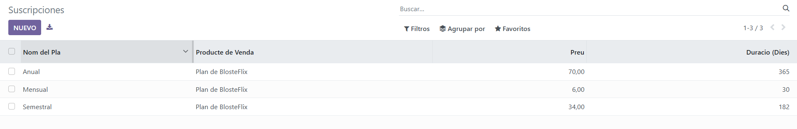

**Campos:**
- `name`: Nombre del plan (ej: "Plan Básico", "Plan Premium")
- `price`: Precio del plan de suscripción
- `duration`: Duración en días del plan (por defecto 30 días)
- `user_subscription_ids`: Relación con usuarios que tienen este plan
- `product_id`: Vinculación con producto de venta de Odoo
- `sale_order_id`: Orden de venta asociada
- `partner_id`: Cliente (heredado de sale_order)

**Responsabilidades:**
- Definir los diferentes planes de suscripción disponibles
- Mantener información de precios y duración
- Vincular con el sistema de ventas de Odoo

##### bloste.user_subscription
Tabla de relación entre usuarios y sus suscripciones (historial).

<!-- TODO: Imagen -->


**Campos:**
- `user_id`: Usuario que tiene la suscripción
- `subscription_id`: Plan de suscripción asociado
- `start_date`: Fecha de inicio (por defecto hoy)
- `end_date`: Fecha de caducidad (calculada automáticamente)

**Métodos:**
- `_compute_end_date()`: Calcula automáticamente la fecha de caducidad sumando la duración del plan a la fecha de inicio

**Responsabilidades:**
- Mantener historial completo de suscripciones de cada usuario
- Calcular automáticamente fechas de vencimiento
- Permitir múltiples suscripciones por usuario (historial)

##### res.users (extensión)
Extiende el modelo de usuarios estándar de Odoo con funcionalidad específica de BlosteFlix.


**Campos añadidos:**
- `user_subscription_ids`: Relación con todas las suscripciones del usuario
- `bloste_api_uuid`: UUID único para identificación en API
- `bloste_status`: Estado del usuario ('user' o 'admin')
- `is_admin_bloste`: Indicador booleano de administrador
- `active_subscription_id`: Suscripción activa actual (calculado)
- `subscription_expiry_date`: Fecha de expiración de la suscripción activa (calculado)
- `new_subscription_id`: Campo auxiliar para asignar nuevas suscripciones
- `password_display`: Indicador visual de contraseña configurada

**Métodos clave:**
- `_compute_active_subscription()`: Determina cuál es la suscripción activa (la que caduca más pronto entre las válidas)
- `_compute_subscription_expiry()`: Obtiene la fecha de caducidad de la suscripción activa
- `_compute_password_display()`: Muestra un indicador visual de contraseña
- `_make_odoo_admin()`: Convierte un usuario en administrador de Odoo
- `_remove_odoo_admin()`: Quita permisos de administrador y convierte en usuario portal
- `create()`: Sobrescribe creación para usar email como login si no se proporciona
- `write()`: Gestiona la lógica de asignación de suscripciones y cambios de rol

**Responsabilidades:**
- Gestionar el estado de suscripción de cada usuario
- Calcular automáticamente la suscripción activa
- Controlar permisos según el rol (usuario/admin)
- Mantener sincronización entre estado BlosteFlix y permisos Odoo
- Gestionar asignación de nuevas suscripciones

##### product.template (extensión)
Extiende el modelo de productos de Odoo.

**Campos añadidos:**
- `is_subscription_product`: Marca si el producto es un plan de suscripción

**Responsabilidades:**
- Diferenciar productos de suscripción de otros productos
- Integrar suscripciones con el módulo de ventas de Odoo

#### Vistas (views/)

<!-- TODO: Imagen -->


- **menu_view.xml**: Define el menú principal "Bloste Software" en la interfaz de Odoo
- **subscriptors.xml**: Vista para gestionar planes de suscripción
- **user_subscription.xml**: Vista para el historial de suscripciones de usuarios
- **res_users.xml**: Vista extendida de usuarios con campos personalizados
- **product_view.xml**: Vista extendida de productos para marcar planes de suscripción

#### Seguridad (security/)

<!-- TODO: Imagen -->


**ir.model.access.csv**: Define los permisos de acceso a los modelos:
- `access_bloste_subscription`: Permisos completos (CRUD) para usuarios internos
- `access_bloste_user_subscription`: Permisos completos (CRUD) para usuarios internos
- `access_bloste_res_users`: Permisos completos (CRUD) para gestión de usuarios

### Dependencias

El módulo `bloste_core` depende de:
- `base`: Módulo base de Odoo (usuarios, grupos, permisos)
- `sale`: Módulo de ventas (órdenes, productos)
- `product`: Módulo de productos

### Configuración del Manifiesto

```python
{
    'name': 'Bloste-Software',
    'version': '1.0',
    'summary': 'Bloste Software Core Module',
    'description': 'Módulo para la gestión de suscripciones y usuarios, 
                    y creación y validación de tokens',
    'author': 'Bloste Team',
    'license': 'LGPL-3',
    'depends': ['base', 'sale', 'product'],
    'installable': True,
    'application': True,
    'auto_install': False,
}
```

## Diagrama E-R

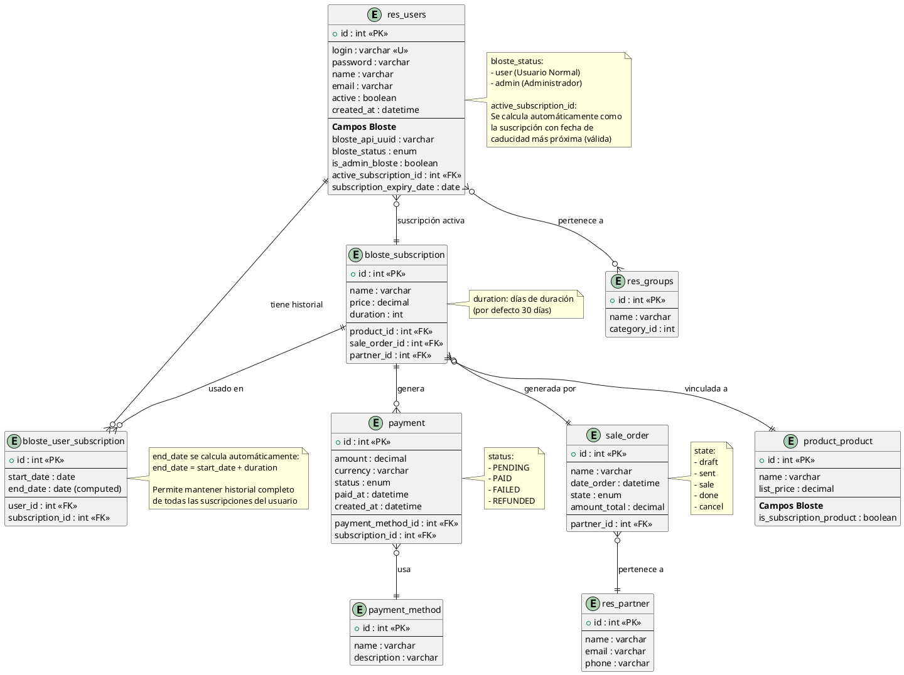

## Modelo de Datos

### res.users (extendido)
Usuarios del sistema con funcionalidad específica de BlosteFlix.

**Campos estándar:**
- `id`: Identificador único
- `login`: Nombre de usuario para autenticación
- `password`: Contraseña encriptada
- `name`: Nombre completo
- `email`: Correo electrónico
- `active`: Indica si el usuario está activo

**Campos BlosteFlix:**
- `bloste_api_uuid`: UUID para identificación en API externa
- `bloste_status`: Estado del usuario ('user' o 'admin')
- `is_admin_bloste`: Indica si es administrador de BlosteFlix
- `active_subscription_id`: Referencia a la suscripción activa actual
- `subscription_expiry_date`: Fecha de caducidad calculada
- `user_subscription_ids`: Historial completo de suscripciones

### bloste.subscription
Planes de suscripción disponibles en la plataforma.

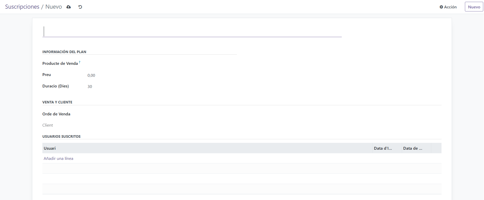

**Campos:**
- `id`: Identificador único del plan
- `name`: Nombre del plan (ej: "Plan Mensual", "Plan Anual")
- `price`: Precio del plan
- `duration`: Duración en días (por defecto 30)
- `product_id`: Vinculación con producto de Odoo
- `sale_order_id`: Orden de venta asociada
- `partner_id`: Cliente (heredado de sale_order)
- `user_subscription_ids`: Usuarios que tienen/tuvieron este plan

### bloste.user_subscription
Historial de suscripciones de usuarios (relación usuario-plan).

<!-- TODO: Imagen -->


**Campos:**
- `id`: Identificador único de la relación
- `user_id`: Usuario asociado
- `subscription_id`: Plan de suscripción asociado
- `start_date`: Fecha de inicio (por defecto hoy)
- `end_date`: Fecha de caducidad (calculada automáticamente)

**Lógica de cálculo:**
- `end_date = start_date + duration` (de la suscripción)

### product.product (extendido)
Productos de Odoo extendidos para soportar suscripciones.

**Campos añadidos:**
- `is_subscription_product`: Marca si el producto representa un plan de suscripción

### payment_method
Métodos de pago disponibles.

**Campos:**
- `id`: Identificador único
- `name`: Nombre del método (ej: "Tarjeta de Crédito", "PayPal")
- `description`: Descripción del método

### payment
Historial de pagos realizados.

**Campos:**
- `id`: Identificador único
- `amount`: Monto del pago
- `currency`: Moneda (ej: "EUR", "USD")
- `status`: Estado del pago (PENDING, PAID, FAILED, REFUNDED)
- `paid_at`: Fecha y hora del pago
- `payment_method_id`: Método de pago utilizado
- `subscription_id`: Suscripción asociada


<!-- TODO: Revisar casos de uso, no se entiende nada, igual con plantuml es mejor -->
## Casos de uso

```mermaid
%%{init: {'theme':'base','themeVariables': {'primaryColor':'#0ea5a4','edgeColor':'#065f46','fontFamily':'"Inter", Arial'}} }%%
graph LR
  %% Agrupación de usuarios
  subgraph Usuarios
    direction TB
    U1[Usuario/Cliente]
    U2[Administrador]
    U3[Portal Web]
    U4[Video Player]
  end

  %% Casos de uso divididos en áreas
  subgraph "Casos de uso"
    direction LR
    
    subgraph "Gestión de Usuarios"
      direction TB
      UC1((Crear usuario))
      UC2((Autenticar usuario))
      UC3((Editar perfil))
      UC4((Cambiar contraseña))
      UC5((Activar/Desactivar))
    end

    subgraph "Gestión de Suscripciones"
      direction TB
      UC6((Crear plan suscripción))
      UC7((Asignar suscripción))
      UC8((Renovar suscripción))
      UC9((Consultar estado))
      UC10((Ver historial))
      UC11((Cancelar suscripción))
    end

    subgraph "Gestión de Roles"
      direction TB
      UC12((Asignar admin))
      UC13((Revocar admin))
      UC14((Gestionar permisos))
    end

    subgraph "Gestión de Pagos"
      direction TB
      UC15((Registrar método pago))
      UC16((Procesar pago))
      UC17((Consultar pagos))
      UC18((Reembolsar))
    end
    
    subgraph "Integración API"
      direction TB
      UC19((Generar JWT))
      UC20((Validar token))
      UC21((Consultar suscripción activa))
    end
  end

  %% Relaciones - Usuario Cliente
  U1 -->|POST| UC1
  U1 -->|POST| UC2
  U1 -->|PUT| UC3
  U1 -->|PUT| UC4
  U1 -->|GET| UC9
  U1 -->|POST| UC15
  U1 -->|GET| UC17

  %% Relaciones - Administrador
  U2 -->|POST/PUT| UC1
  U2 -->|POST/PUT| UC5
  U2 -->|POST/PUT| UC6
  U2 -->|POST| UC7
  U2 -->|GET| UC10
  U2 -->|POST| UC12
  U2 -->|POST| UC13
  U2 -->|POST/PUT| UC14
  U2 -->|POST| UC16
  U2 -->|GET| UC17
  U2 -->|POST| UC18

  %% Relaciones - Portal Web
  U3 -->|POST| UC2
  U3 -->|POST| UC8
  U3 -->|POST| UC16
  U3 -->|GET| UC9

  %% Relaciones - Video Player
  U4 -->|POST| UC19
  U4 -->|POST| UC20
  U4 -->|GET| UC21

  %% Estilos
  class U1,U2,U3,U4 usernode
  class UC1,UC2,UC3,UC4,UC5,UC6,UC7,UC8,UC9,UC10,UC11,UC12,UC13,UC14,UC15,UC16,UC17,UC18,UC19,UC20,UC21 usecase

  classDef usernode fill:#e0f2fe,stroke:#0369a1,stroke-width:2px,rx:8px;
  classDef usecase fill:#ecfccb,stroke:#65a30d,stroke-width:1.5px,rx:20px;
```

## Diagramas de flujo

### Autenticación y Generación de Token

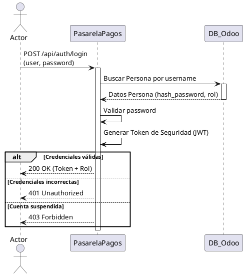

### Gestión de Suscripción y Pago

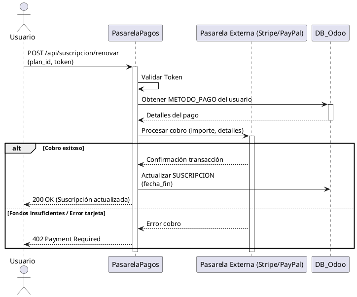

### Asignar Suscripción a Usuario (Módulo Bloste Core)

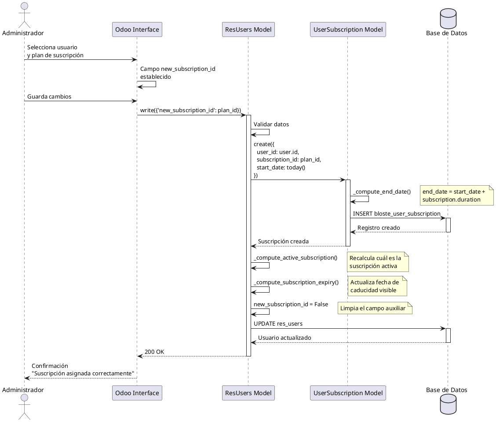

### Calcular Suscripción Activa

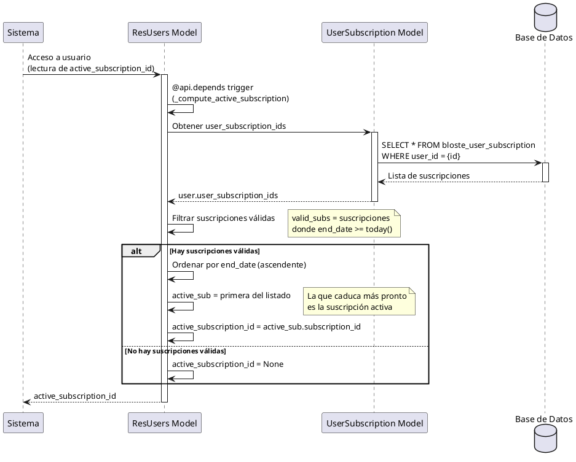

### Cambiar Rol de Usuario (User a Admin)

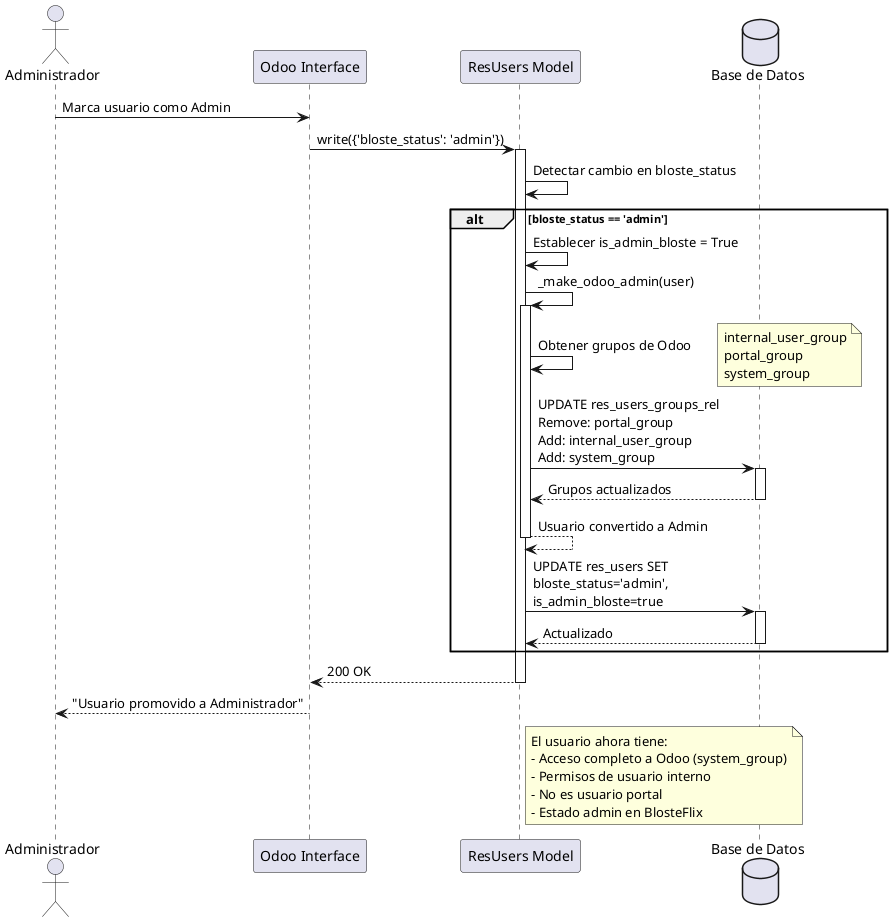

### Crear Usuario Nuevo

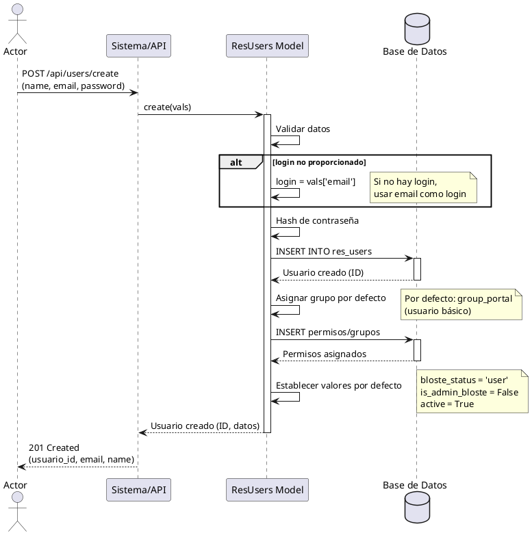

### Consultar Estado de Suscripción (API Externa)

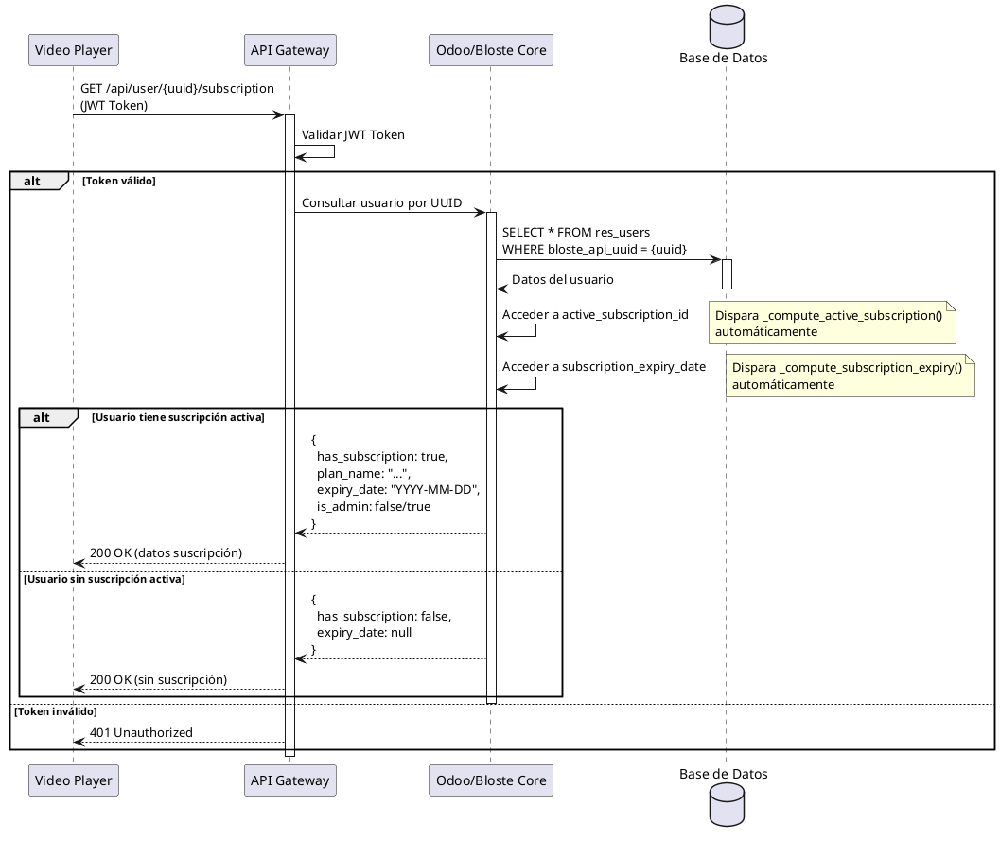

## Arquitectura y Tecnologías

### Stack Tecnológico
- **Framework**: Odoo 16/17
- **Lenguaje**: Python 3.8+
- **Base de Datos**: PostgreSQL
- **ORM**: Odoo ORM
- **API**: RESTful API / XML-RPC / JSON-RPC
- **Autenticación**: JWT + Odoo Session

### Módulos de Odoo Utilizados
- **base**: Funcionalidad base (usuarios, grupos, permisos)
- **sale**: Gestión de ventas y órdenes
- **product**: Gestión de productos
- **portal**: Funcionalidad de portal para usuarios externos

### Componentes del Módulo Bloste Core

#### Models (Lógica de negocio)
- `bloste.subscription`: Planes de suscripción
- `bloste.user_subscription`: Historial usuario-suscripción
- `res.users (inherit)`: Extensión del modelo de usuarios
- `product.template (inherit)`: Extensión de productos

#### Views (Interfaz de usuario)
- Formularios y listas para gestión de suscripciones
- Vistas personalizadas de usuarios con campos Bloste
- Menús de navegación personalizados

#### Security (Control de acceso)
- Reglas de acceso basadas en grupos de Odoo
- Permisos CRUD granulares por modelo

#### Computed Fields
- **active_subscription_id**: Calcula automáticamente la suscripción activa del usuario
- **subscription_expiry_date**: Calcula la fecha de expiración de la suscripción activa
- **end_date** (en user_subscription): Calcula la fecha de fin basada en duración

### Flujo de Datos

1. **Creación de plan**: Admin crea `bloste.subscription` con precio y duración
2. **Asignación**: Admin usa `new_subscription_id` en usuario
3. **Registro automático**: Se crea `bloste.user_subscription` con fecha de inicio
4. **Cálculo de caducidad**: `end_date` se calcula automáticamente
5. **Actualización de estado**: `active_subscription_id` se actualiza automáticamente
6. **Consulta externa**: APIs consultan `active_subscription_id` y `subscription_expiry_date`

### Seguridad y Permisos

#### Grupos de Odoo

<!-- TODO: Imagen -->


- **Portal User** (`base.group_portal`): Usuario básico con acceso limitado
- **Internal User** (`base.group_user`): Usuario interno con acceso a backend
- **System Administrator** (`base.group_system`): Administrador con acceso completo

#### Sincronización de Roles
- Usuario con `bloste_status='admin'` → Se asignan grupos de administrador de Odoo
- Usuario con `bloste_status='user'` → Se mantiene como usuario portal

### Integraciones

#### API REST/JSON-RPC
- Consulta de estado de suscripción por UUID
- Validación de tokens JWT
- Sincronización con servicios externos (Video Player, Admin App)

#### Sistema de Ventas
- Vinculación de suscripciones con productos de Odoo
- Generación de órdenes de venta
- Tracking de pagos y renovaciones
