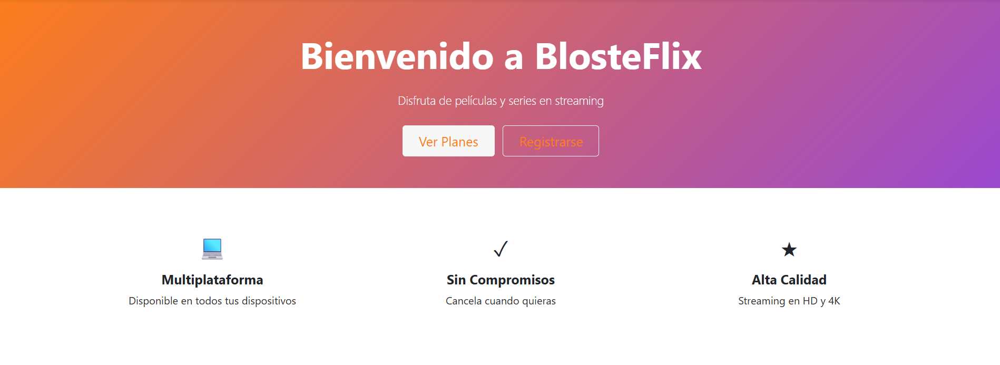
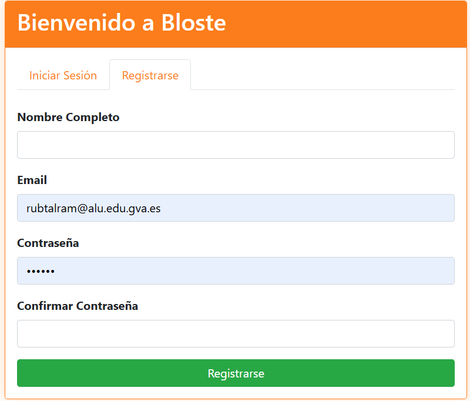
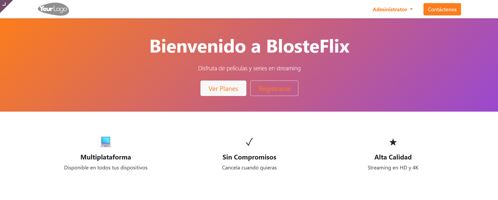
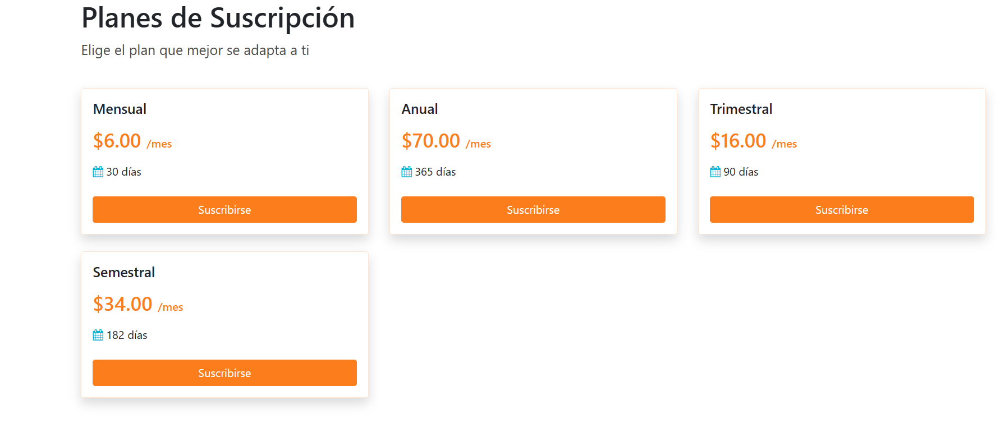
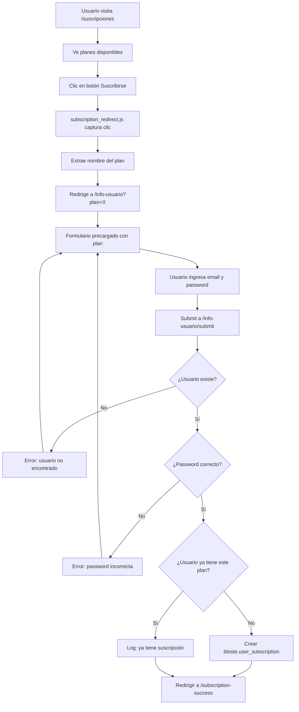

# Bloste Web - Módulo de Sitio Web

## Descripción General

`bloste_web` es el módulo de Odoo que proporciona la interfaz web pública para la plataforma Bloste. Este módulo gestiona las páginas públicas del sitio, el registro de usuarios, la visualización de planes de suscripción y el proceso de contratación.



**Características principales:**
- Página de inicio (home) con hero section y características del servicio
- Sistema de registro de usuarios con validación
- Visualización de planes de suscripción
- Proceso de contratación de suscripciones
- Integración con Website Builder de Odoo
- Sistema de redirección inteligente para selección de planes
- Estilos personalizados con la paleta de colores de Bloste

## Estructura del Módulo

```
bloste_web/
├── __init__.py
├── __manifest__.py
├── controllers/
│   ├── __init__.py
│   └── main.py
├── models/
│   ├── __init__.py
│   └── bloste_web.py
├── views/
│   ├── assets.xml
│   ├── menus.xml
│   ├── templates.xml
│   └── website_pages.xml
├── static/
│   └── src/
│       ├── css/
│       │   └── bloste_colors.css
│       └── js/
│           └── subscription_redirect.js
└── security/
    └── ir.model.access.csv
```

## Manifest (__manifest__.py)

```python
{
    'name': 'Bloste Website',
    'version': '1.0',
    'depends': ['base', 'bloste_core', 'website'],
    'author': 'Bloste Software',
    'category': 'Bloste',
    'license': 'LGPL-3',
    'installable': True,
    'application': True,
    'data': [
        'security/ir.model.access.csv',
        'views/menus.xml',
        'views/templates.xml',
        'views/website_pages.xml',
        'views/assets.xml',
    ],
}
```

**Dependencias:**
- `base`: Módulo base de Odoo
- `bloste_core`: Módulo core de Bloste con modelos de suscripción
- `website`: Módulo de sitio web de Odoo

## Modelos

### BlosteWeb (`bloste.web`)

Modelo auxiliar para datos relacionados con el sitio web.

**Archivo:** `models/bloste_web.py`

```python
class BlosteWeb(models.Model):
    _name = 'bloste.web'
    _description = 'Modelo de Bloste Web'

    name = fields.Char(string='Nombre', required=True)
    description = fields.Text(string='Descripción')
```

**Campos:**
- `name`: Nombre identificador (requerido)
- `description`: Descripción del elemento

## Controladores

### BlosteWebsite (`controllers/main.py`)

Controlador principal que gestiona todas las rutas y páginas públicas del sitio web.

#### Métodos Principales

##### `_render_website_page_with_plans(url)`

Método privado para renderizar páginas creadas en Website Builder con contexto de planes de suscripción.

**Parámetros:**
- `url` (str): URL de la página a renderizar

**Retorna:** Template renderizado con contexto de suscripciones

**Funcionalidad:**
- Busca todos los planes de suscripción disponibles
- Busca la página web por URL
- Renderiza la vista con contexto de suscripciones

#### Rutas HTTP

##### `/in` - Página de Login/Registro

```python
@http.route('/in', type='http', auth='public', website=True)
def login_register(self):
    """Pagina de login/registre"""
    return request.render('bloste_web.login_register_template')
```

**Descripción:** Página pública de registro de usuarios con formulario completo y validación.

**Características:**
- Formulario de registro con validación de contraseña
- Confirmación de contraseña
- Validación desde JavaScript
- Integración con API de autenticación

##### `/suscripciones` - Planes de Suscripción

```python
@http.route('/suscripciones', type='http', auth='public', website=True)
def subscription_plans(self):
    """Pagina publica de plans de subscripcio"""
    return self._render_website_page_with_plans('/suscripciones')
```

**Descripción:** Página que muestra todos los planes de suscripción disponibles.

**Características:**
- Listado dinámico de planes desde BD
- Diseño responsive con cards
- Botones de suscripción con JavaScript interactivo

##### `/planes` y `/productos` - Alias de Suscripciones

```python
@http.route('/planes', type='http', auth='public', website=True)
def subscription_plans_alias(self):
    """Alias: planes = suscripciones"""
    return request.redirect('/suscripciones')

@http.route('/productos', type='http', auth='public', website=True)
def products(self):
    """Alias: productos = planes"""
    return request.redirect('/suscripciones')
```

**Descripción:** Rutas alternativas que redirigen a `/suscripciones`.

##### `/info-usuario` - Información del Usuario


```python
@http.route('/info-usuario', type='http', auth='public', website=True)
def info_usuario(self, plan=None, **kwargs):
    """Pagina d'informacio de l'usuari amb pla preseleccionat"""
```

**Descripción:** Página con formulario para que el usuario ingrese sus credenciales y confirme la contratación de un plan.

**Parámetros GET:**
- `plan` (opcional): Nombre del plan preseleccionado

**Características:**
- Preselección del plan desde URL
- Formulario de autenticación
- Vista renderizada desde BD o template

##### `/info-usuario/submit` - Procesamiento de Contratación

```python
@http.route('/info-usuario/submit', type='http', auth='public', website=True, methods=['POST'], csrf=True)
def info_usuario_submit(self, **post):
    """Processa l'enviament del formulari: autentica usuari i assigna subscripcio"""
```

**Descripción:** Endpoint POST que procesa la contratación de suscripciones.

**Parámetros POST:**
- `email`: Email del usuario
- `password`: Contraseña del usuario
- `subscription_plan`: Nombre del plan a contratar

**Flujo:**
1. Validación de email y contraseña
2. Búsqueda del usuario en BD
3. Verificación de credenciales con `_check_credentials()`
4. Búsqueda del plan de suscripción
5. Verificación de suscripción existente
6. Creación de nueva suscripción si no existe
7. Redirección a página de éxito

**Manejo de Errores:**
- Usuario no encontrado
- Contraseña incorrecta
- Plan de suscripción no encontrado
- Errores de BD

**Logging:** Registra todas las operaciones importantes con `_logger`

## Vistas y Templates

### Templates (views/templates.xml)

#### `login_register_template`

Template de registro de usuarios con diseño moderno y validación.



**Características:**
- Diseño con gradiente de colores Bloste
- Card con sombra y bordes redondeados
- Formulario con validación de campos:
  - Nombre completo
  - Email
  - Contraseña (mínimo 6 caracteres)
  - Confirmación de contraseña
- JavaScript para validación y envío asíncrono
- Spinner de carga durante el registro
- Mensajes de éxito/error con Bootstrap alerts
- Redirección automática tras éxito

**Endpoint de API:** `/api/auth/register` (POST)

**Estilos personalizados:**
- Bordes redondeados (15px)
- Gradiente en header
- Inputs con tamaño grande (form-control-lg)
- Botón con gradiente y animación

### Páginas del Sitio (views/website_pages.xml)

#### Configuración del Sitio Web

```xml
<record id="bloste_website" model="website">
    <field name="name">Bloste</field>
    <field name="domain" eval="False"/>
    <field name="company_id" ref="base.main_company"/>
</record>
```

#### `home_page_view` - Página de Inicio

Template de la página principal con diseño moderno.



**Secciones:**

1. **Hero Section:**
   - Gradiente naranja a morado
   - Título principal "Bienvenido a BlosteFlix"
   - Subtítulo descriptivo
   - Botones CTA: "Ver Planes" y "Registrarse"

2. **Características:**
   - Grid responsive de 3 columnas
   - Iconos con emojis
   - Títulos y descripciones:
     - 💻 Multiplataforma
     - ✓ Sin Compromisos
     - ★ Alta Calidad

#### `suscripciones_page_view` - Página de Suscripciones

Template para mostrar planes de suscripción disponibles.



**Elementos:**
- Título y descripción
- Grid responsive de cards
- Iteración sobre `subscriptions` (contexto del controlador)
- Para cada suscripción muestra:
  - Nombre del plan
  - Precio con formato ($XX.XX/mes)
  - Duración en días
  - Botón "Suscribirse" con data-plan

**Condicional:** Muestra alerta si no hay planes disponibles


#### Templates Adicionales

El archivo contiene más templates incluyendo:
- `info_usuario_page_view`: Formulario de información del usuario
- `subscription_success_page_view`: Página de éxito tras contratación
- `payment_page_view`: Página de procesamiento de pago

### Menús (views/menus.xml)


Estructura de menús en el backend de Odoo:

```xml
<menuitem id="bloste_website_menu" 
          name="Bloste Website" 
          sequence="10"/>

<menuitem id="bloste_pages_menu" 
          name="Páginas" 
          parent="bloste_website_menu" 
          action="website.action_website_pages_list"/>

<menuitem id="bloste_subscriptions_menu" 
          name="Suscripciones" 
          parent="bloste_website_menu" 
          action="bloste_core.action_bloste_subscription"/>
```

**Menús:**
1. **Bloste Website** (raíz): Menú principal con icono personalizado
2. **Páginas**: Acceso al gestor de páginas web
3. **Suscripciones**: Acceso a gestión de planes de suscripción

### Assets (views/assets.xml)

Hereda del template `website.layout` para incluir CSS personalizado:

```xml
<template id="bloste_assets" inherit_id="website.layout">
    <xpath expr="//head" position="inside">
        <link rel="stylesheet" href="/bloste_web/static/src/css/bloste_colors.css"/>
    </xpath>
</template>
```

**Funcionalidad:** Inyecta la hoja de estilos de colores Bloste en todas las páginas del sitio.

## Recursos Estáticos

### CSS - bloste_colors.css

**Variables CSS:**
```css
:root {
    --bloste-primary: #FC7D1C;      /* Naranja */
    --bloste-secondary: #9A48D0;    /* Morado */
    --bloste-white: #FFFFFF;
    --bloste-dark: #383E45;
    --bloste-success: #10b981;
    --bloste-info: #06b6d4;
    --bloste-warning: #f59e0b;
    --bloste-danger: #ef4444;
}
```

**Clases personalizadas:**

1. **Botones:**
   - `.btn-primary`: Color naranja con hover
   - `.btn-secondary`: Color morado con hover

2. **Textos:**
   - `.text-primary`: Color naranja
   - `.text-secondary`: Color morado
   - `.text-success`: Verde
   - `.text-info`: Cyan

**Efectos:**
- Estados hover con colores ligeramente más oscuros
- Uso de `!important` para sobrescribir estilos de Bootstrap

### JavaScript - subscription_redirect.js

**Funcionalidad principal:**

#### 1. Preselección de Plan desde URL

```javascript
var urlParams = new URLSearchParams(window.location.search);
var plan = urlParams.get('plan');

if (plan) {
    var planInputs = document.querySelectorAll('input[name="plan"], ...');
    planInputs.forEach(function(input) {
        if (!input.value || input.value === '') {
            input.value = decodeURIComponent(plan);
        }
    });
}
```

**Descripción:** Captura el parámetro `plan` de la URL y lo asigna automáticamente a los inputs del formulario.

#### 2. Manejo de Clics en Botones de Suscripción

```javascript
function handleSubscriptionClick(e) {
    var button = e.target.closest('a, button');
    // ... validaciones ...
    
    var buttonText = button.textContent.trim().toLowerCase();
    if (buttonText.includes('suscrib') || 
        buttonText.includes('contratar') || 
        buttonText.includes('elegir')) {
        // Extraer nombre del plan
        var planName = '...'; // desde card parent
        
        if (planName) {
            e.preventDefault();
            e.stopPropagation();
            window.location.href = '/info-usuario?plan=' + encodeURIComponent(planName);
        }
    }
}

document.body.addEventListener('click', handleSubscriptionClick);
```

**Descripción:**
- Event listener en todo el body
- Detecta clics en botones con texto "suscrib", "contratar" o "elegir"
- Excluye botones dentro de formularios de pago
- Busca el nombre del plan en el card parent
- Redirige a `/info-usuario` con el plan en la URL

**Selectores de búsqueda de plan:**
- Cards: `.card`, `.col-md-4`, `.s_text_block`
- Títulos: `h1-h6`, `.card-title`, `.title`, `[class*="title"]`

**Logging:** Console.log para debug de clics y extracción de planes

## Seguridad

### ir.model.access.csv

Define los permisos de acceso al modelo `bloste.web`:

```csv
id,name,model_id:id,group_id:id,perm_read,perm_write,perm_create,perm_unlink
access_bloste_web,access_bloste_web,model_bloste_web,,1,1,1,1
```

**Permisos:**
- **Read:** ✓ Lectura permitida
- **Write:** ✓ Escritura permitida
- **Create:** ✓ Creación permitida
- **Unlink:** ✓ Eliminación permitida

**Grupo:** Sin grupo específico (todos los usuarios)

## Flujo de Contratación de Suscripción




## Integración con Otros Módulos

### bloste_core

El módulo `bloste_web` depende de `bloste_core` para:

1. **Modelos de suscripción:**
   - `bloste.subscription`: Planes de suscripción
   - `bloste.user_subscription`: Relación usuario-suscripción

2. **Acciones y vistas:**
   - `bloste_core.action_bloste_subscription`: Acción del menú de suscripciones

**Ejemplo de uso:**
```python
# Buscar planes disponibles
subscriptions = request.env['bloste.subscription'].sudo().search([])

# Crear suscripción de usuario
new_subscription = request.env['bloste.user_subscription'].sudo().create({
    'user_id': user.id,
    'subscription_id': subscription.id,
    'start_date': fields.Date.today(),
})
```

### website (Odoo)

Integración con el módulo Website Builder de Odoo:

1. **Layout base:**
   - Usa `website.layout` como template padre
   - Hereda estilos y estructura de Odoo

2. **Gestión de páginas:**
   - Acceso a `website.page` para páginas dinámicas
   - Menú de gestión de páginas

3. **Website context:**
   - Variable `website` disponible en templates
   - Configuración de dominio y compañía

### bloste_jwt

Aunque no es una dependencia directa, el registro de usuarios se integra con `bloste_jwt` a través del endpoint `/api/auth/register` mencionado en el JavaScript.

## Consideraciones de Desarrollo

### Multiidioma

El código contiene comentarios mezclando catalán y castellano:
- Comentarios: Mayormente en catalán
- Contenido visible: En castellano
- Mensajes de log: En catalán

**Recomendación:** Unificar el idioma o implementar sistema i18n de Odoo.

### Validación de Contraseñas

La validación de contraseñas se hace en varios niveles:

1. **HTML5:** `minlength="6"` en inputs
2. **JavaScript:** Validación antes de enviar
3. **Backend:** `_check_credentials()` de Odoo

### Uso de sudo()

El código usa `.sudo()` frecuentemente para operaciones de BD:

```python
subscriptions = request.env['bloste.subscription'].sudo().search([])
user = request.env['res.users'].sudo().search([('login', '=', email)])
```

**Propósito:** Permitir acceso a modelos desde contexto público sin permisos específicos.

**Precaución:** Usar con cuidado para evitar bypasses de seguridad.

### Logging

El controlador implementa logging completo:

```python
import logging
_logger = logging.getLogger(__name__)

_logger.info(f"Intent de contractacio - Email: {email}")
_logger.warning(f"Usuari no trobat: {email}")
_logger.error(f"Error al verificar credencials: {str(e)}")
```

**Niveles:**
- **INFO:** Operaciones normales
- **WARNING:** Situaciones sospechosas
- **ERROR:** Errores de sistema

## Mejoras Futuras

1. **Internacionalización:**
   - Implementar módulo i18n de Odoo
   - Traducir todos los textos a múltiples idiomas

2. **Validación mejorada:**
   - Validación de formato de email en backend
   - Validación de complejidad de contraseña
   - Rate limiting para prevenir ataques

3. **UX:**
   - Confirmación por email tras registro
   - Recuperación de contraseña
   - Login social (OAuth)

4. **SEO:**
   - Meta tags personalizados
   - Schema.org markup
   - Sitemap dinámico

5. **Analytics:**
   - Tracking de conversiones
   - Análisis de embudos
   - A/B testing de páginas

6. **Seguridad:**
   - Captcha en formularios
   - Rate limiting
   - HTTPS obligatorio
   - Content Security Policy

## Comandos Útiles

```bash
# Actualizar módulo
odoo-bin -u bloste_web -d bloste_db

# Instalar módulo
odoo-bin -i bloste_web -d bloste_db

# Ver logs en tiempo real
tail -f /var/log/odoo/odoo.log | grep bloste_web

# Verificar rutas registradas
# En Odoo shell:
request.env['ir.http']._get_routing()
```

## Testing

Para probar el módulo:


1. **Página de inicio:**
   ```
   http://localhost:8069/
   ```

2. **Registro:**
   ```
   http://localhost:8069/in
   ```

3. **Planes:**
   ```
   http://localhost:8069/suscripciones
   ```

4. **Contratación:**
   ```
   http://localhost:8069/info-usuario?plan=Premium
   ```

5. **Backend:**
   ```
   http://localhost:8069/web
   → Menú: Bloste Website
   ```
