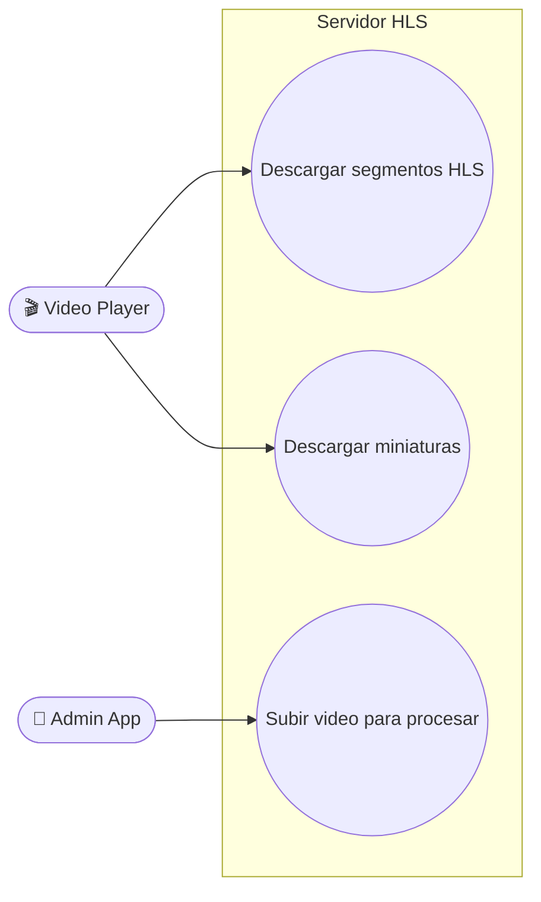
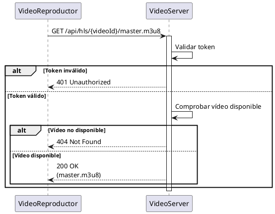
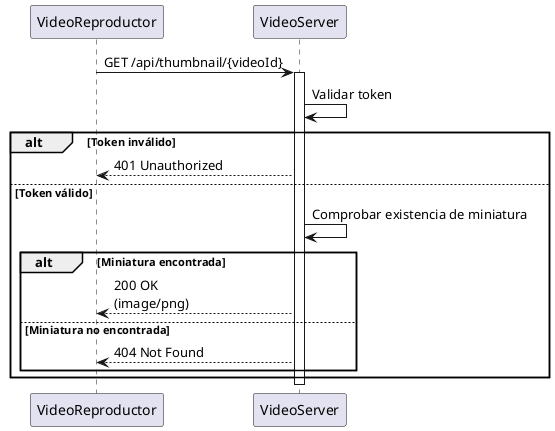
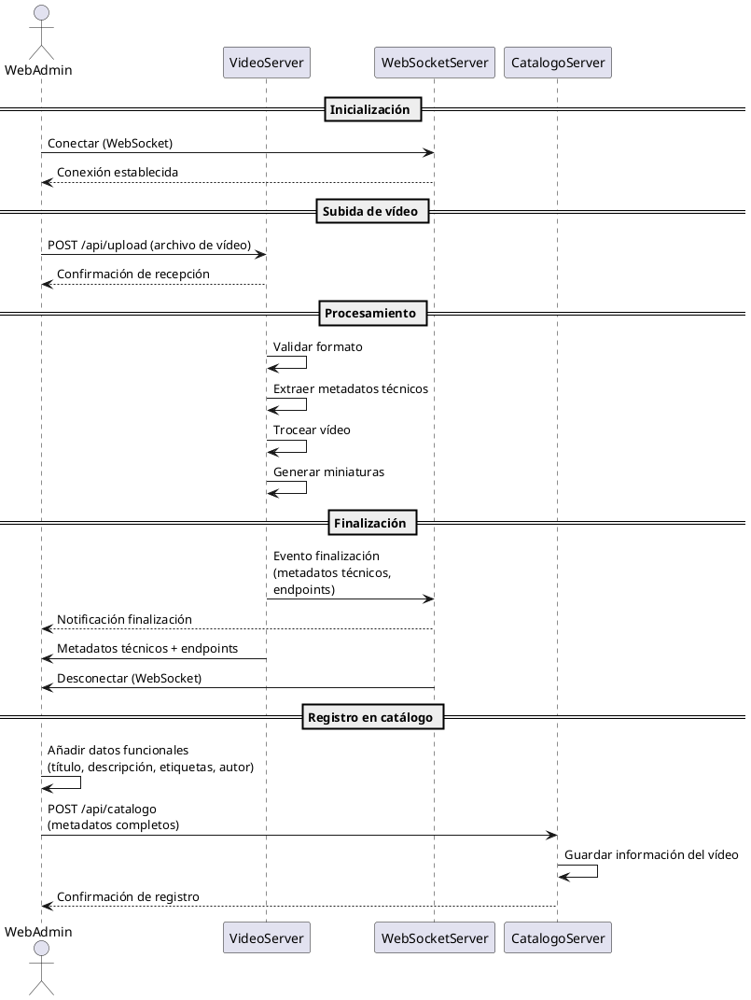

# Servidor HLS de videos (EXPRESSJS)

## Descripción

Servidor express encargado de procesar videos en segmentos y servirlos, además de generar miniaturas y metadatos para los servicios de reproducción.

### Responsabilidades

+ Comprobar autenticación y autorización de los clientes
+ Generar HLS y segmentos de video en distintas resoluciones
+ Generar miniaturas para cada video
+ Generar metadatos técnicos de cada video
+ Servir los segmentos y miniaturas a los clientes

### Interacción

Este componente interactua con:

+ Video Player (Flutter)
+ Admin App (Vue)
+ Autentificaciones (odoo)

## Endpoints

### Endpoints GET

+ `api/hls/:videoid` : Sirve el mapa hls para que el cliente pueda reproducir el video
+ `api/thumbnail/:videoid` : Sirve la miniatura del video al cliente

### Endpoints POST

+ `api/upload` : Recibe un video en bruto para procesarlo y generar los segmentos, miniaturas y metadatos técnicos. Este endpoint es utilizado por la Admin App para subir nuevos videos al sistema.
Además, este endpoint se encarga de validar el formato del video, extraer los metadatos técnicos (duración, resolución, codec) y devolverlos.

## Casos de uso

## Diagramas de flujo

### Reproducir video

### Recibir miniatura

### Subir video

