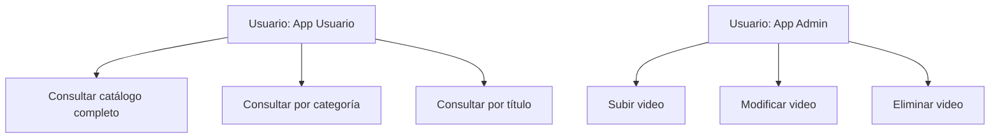
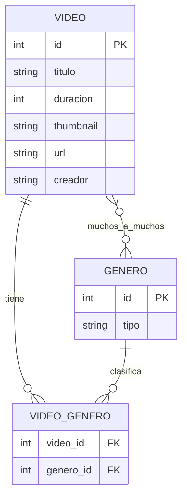

# Backend catálogo
Documentación del backend catálogo.
## ENDPOINTS:
```
        BUSCAR TODO         --> api/catalogo
GET:    BUSCAR POR CATEGORÍA--> api/catalogo/categoria
        BUSCAR POR TITULO   --> api/catalogo/titulo

POST:   SUBIR ENTRADA-CATALOGO--> api/catalogo/:id

PUT:   MODIFICAR VIDEO--> api/catalogo/:id

DELETE:   ELIMINAR VIDEO--> api/catalogo/:id
```
## CASOS DE USO

## Diagrama Entidad Relación

