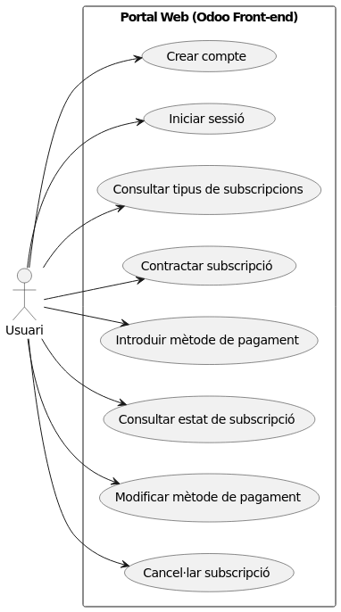

## App de consulta y reproducción

Los casos de uso esenciales son: validar subscripción, reproducir video, iniciar sesión y continuar visualització

## App admin

Los casos de uso esenciales son: iniciar sesión, subir video, confirmar y registrar video.

## App subscripción

Los casos de uso esenciales son: Crear compte, iniciar sesión, contratar subscripción, incluir método de pago y cancelar subscripción.