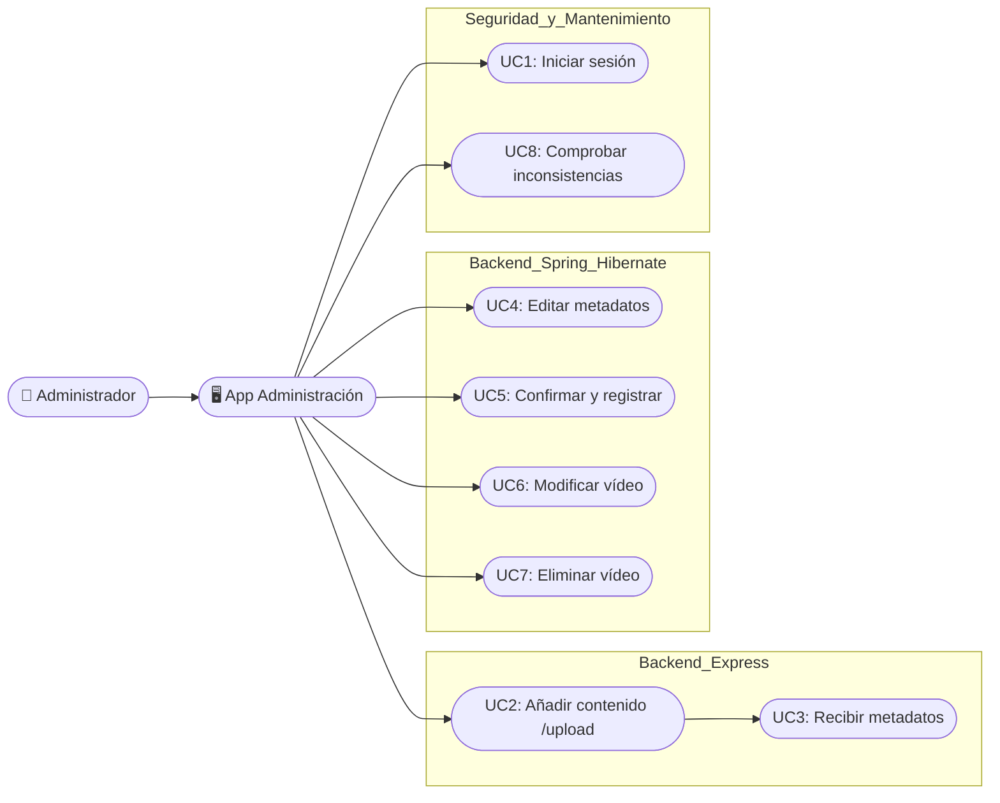
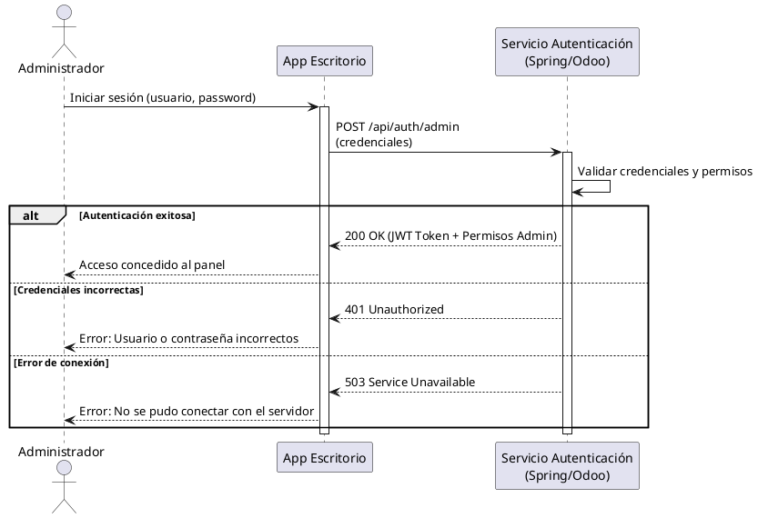
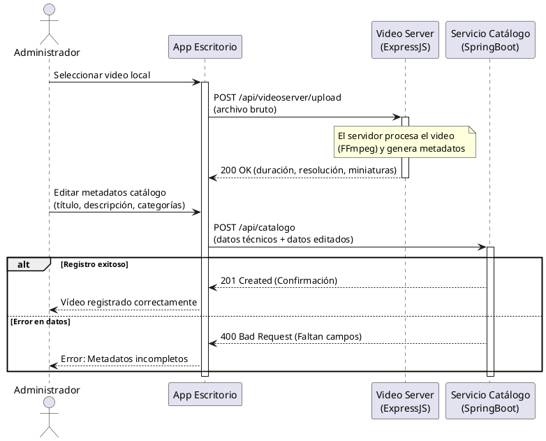

# Administrador Contenidos
Este es la aplicación de administradores para subir contenido

### Que hace ?
+ Gestión de sesión de administrador
+ Subida de archivos de video al servidor de contenidos
+ Procesamiento automatico de metadatos
+ Edicion y resgistro de metadatos en el catálogo
+ Modificación y eliminación de videos existentes

### Interacción
Este componente interactua con:
+ Login Odoo
+ Catálogo backend
+ Video backend

### Endpoints
Segun los casos de uso descritos:
#### Endpoints catalogo
+ POST `api/catalogo`: Registra nueva entrada de video
+ PUT `api/catalogo/:id`: Modificar metadatos de un video existente
+ GET `api/catalogo`: Obtener lista completa para comprobación
+ GET `api/catalogo/:titulo`: Recibe un video del titulo especificado
#### Endpoints de Servidor Express
+ GET `api/hls/:videoid`: Envía el mapa HLS para que el administrador pueda verificar que se reproduce
+ POST `api/videoserver/upload`:

## Casos de uso

## Diagramas de flujo

### Autenticación del Administrador

### Gestión de Contenido: Subida y Registro

