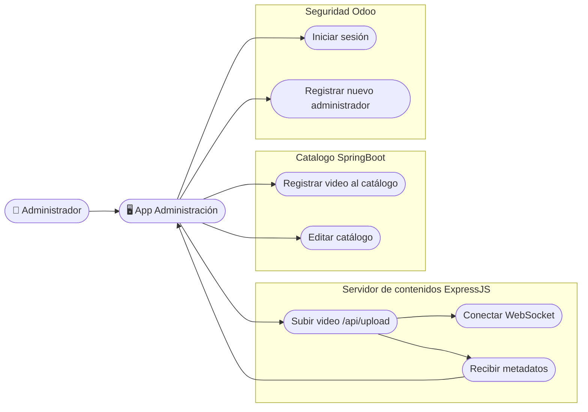
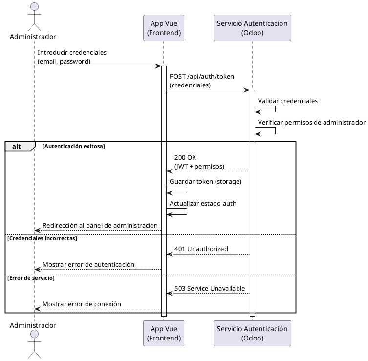
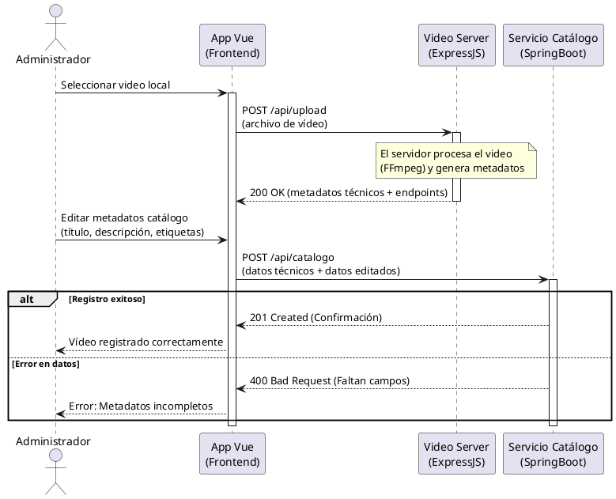
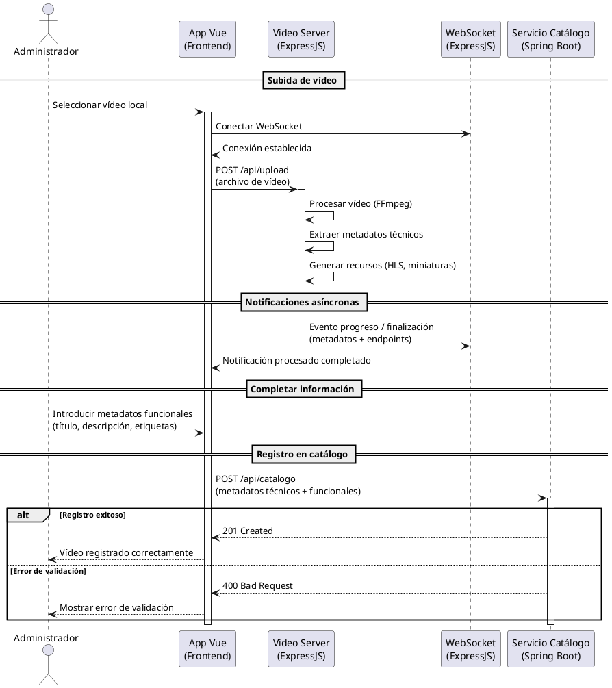
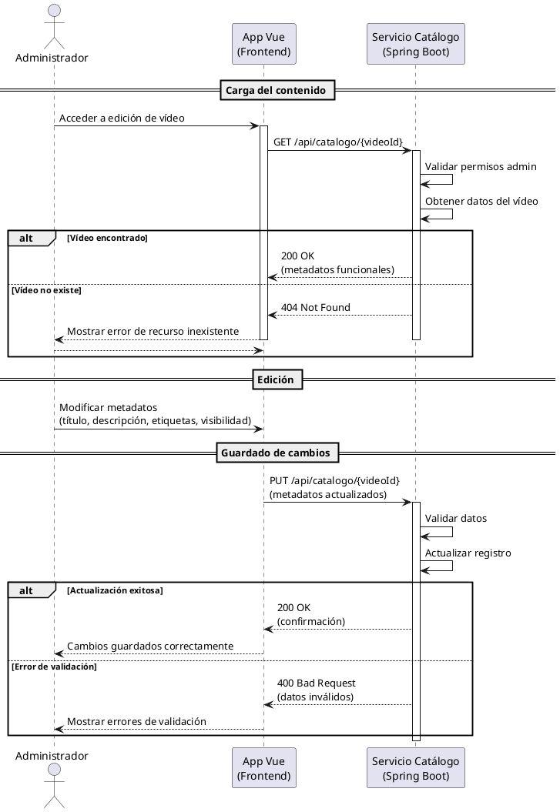
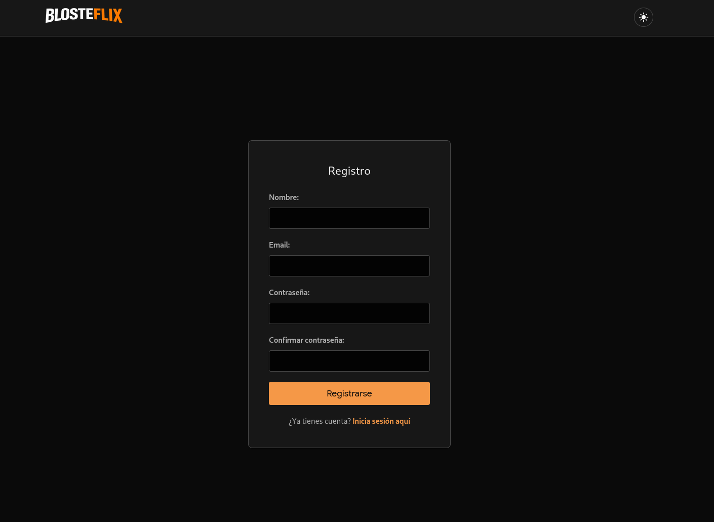
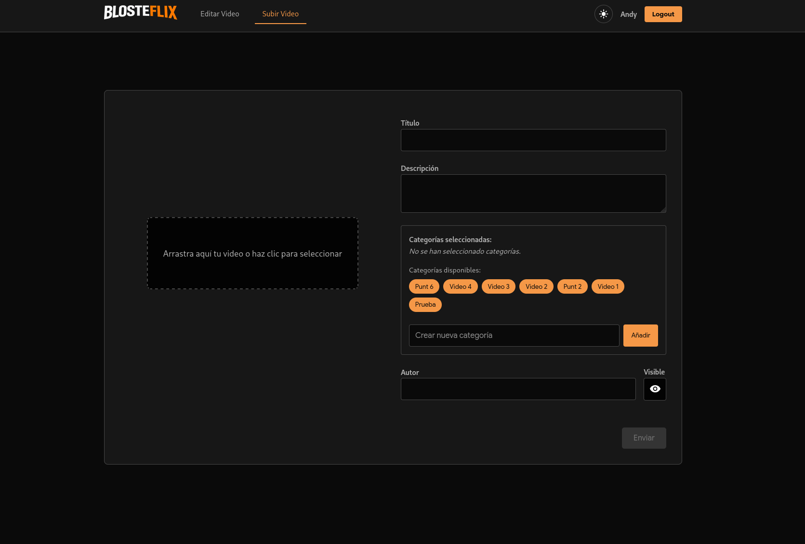
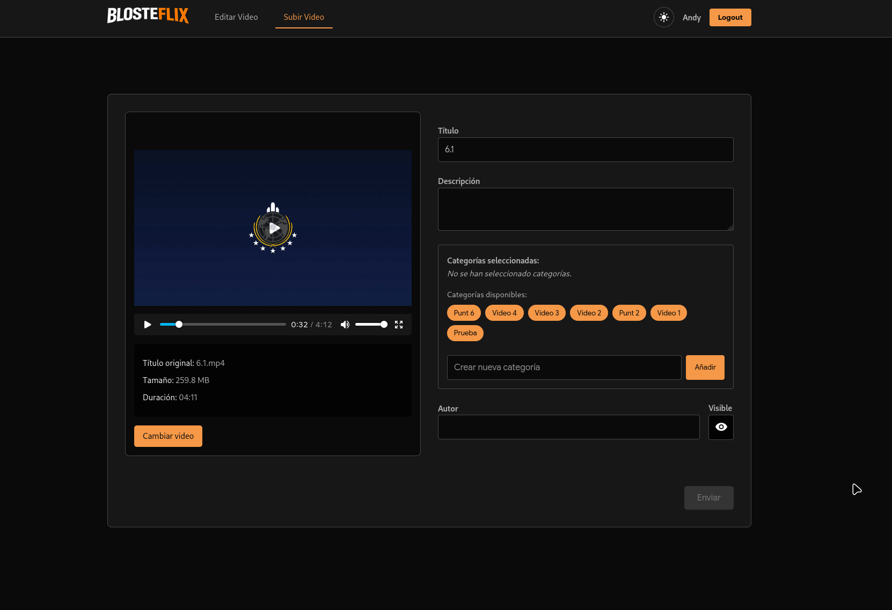

# Administrador Contenidos (VUE)

## Descripción

Aplicación web para la gestión de contenidos de video, permitiendo a los administradores subir nuevos videos y gestionar el catálogo de videos disponibles para los usuarios finales.

### Responsabilidades

+ Subida de  videos al servidor de contenidos
+ Edicion de datos del catalogo de videos (título, descripción, categorías)

### Interacción

Este componente interactua con:

+ `Login/Signin` (Backend Odoo)
+ `Catálogo` (Backend SpringBoot)
+ `VideoServer` (Backend ExpressJS)

### Endpoints

Endpoint usados por la app de administración:

#### Endpoints catalogo

+ POST `api/catalogo`: Registra nueva entrada de video
+ PUT `api/catalogo/:id`: Modificar datos de un video existente
+ GET `api/catalogo/:id`: Obtener datos de un video existente en específico para edición
+ GET `api/catalogo`: Obtener lista completa de videos para mostrar en el panel de administración
+ GET `api/categorias`: Obtener lista de categorías disponibles

#### Endpoints del servidor de contenidos

+ POST `api/upload`: Subir un video en bruto para procesar y generar los segmentos, miniaturas y metadatos técnicos

## Casos de uso

## Diagramas de flujo

### Autenticación del Administrador

### Gestión de Contenido: Subida

### Gestión de Contenido: Edición

## UI/UX

### Login

### Registro

### Subida de video

Sin video de seleccionado:

Con video de seleccionado:

### Panel de edición de video

### Popup de edición de video

