# Administrador Contenidos
Este es la aplicación de administradores para subir contenido

### Que hace ?
+ Gestión de sesión de administrador
+ Subida de archivos de video al servidor de contenidos
+ Procesamiento automatico de metadatos
+ Edicion y resgistro de metadatos en el catálogo
+ Modificación y eliminación de videos existentes

### Interacción
Este componente interactua con:
+ Login Odoo
+ Catálogo backend
+ Video backend

### Endpoints
Segun los casos de uso descritos:
#### Endpoints catalogo
+ POST `api/catalogo`: Registra nueva entrada de video
+ PUT `api/catalogo/:id`: Modificar metadatos de un video existente
+ GET `api/catalogo`: Obtener lista completa para comprobación
+ GET `api/catalogo/:titulo`: Recibe un video del titulo especificado
#### Endpoints de Servidor Express
+ GET `api/hls/:videoid`: Envía el mapa HLS para que el administrador pueda verificar que se reproduce
+ POST `api/videoserver/upload`:

## Casos de uso

```mermaid
flowchart LR
    Admin([👤 Administrador])
    AppAdmin([🖥️ App Administración])

    subgraph Backend_Express
        SubirVideo([UC2: Añadir contenido /upload])
        RecibirMeta([UC3: Recibir metadatos])
    end

    subgraph Backend_Spring_Hibernate
        EditarMeta([UC4: Editar metadatos])
        RegistrarVideo([UC5: Confirmar y registrar])
        ModificarVideo([UC6: Modificar vídeo])
        EliminarVideo([UC7: Eliminar vídeo])
    end

    subgraph Seguridad_y_Mantenimiento
        Login([UC1: Iniciar sesión])
        Inconsistencies([UC8: Comprobar inconsistencias])
    end

    Admin --> AppAdmin
    AppAdmin --> Login
    AppAdmin --> SubirVideo
    SubirVideo --> RecibirMeta
    AppAdmin --> EditarMeta
    AppAdmin --> RegistrarVideo
    AppAdmin --> ModificarVideo
    AppAdmin --> EliminarVideo
    AppAdmin --> Inconsistencies

```

## Diagramas de flujo

### Autenticación del Administrador

### Gestión de Contenido: Subida y Registro

```plantuml
@startuml
actor Administrador
participant AppEscritorio as "App Escritorio"
participant VideoServer as "Video Server\n(ExpressJS)"
participant Catalogo as "Servicio Catálogo\n(SpringBoot)"

Administrador -> AppEscritorio : Seleccionar video local
activate AppEscritorio

AppEscritorio -> VideoServer : POST /api/videoserver/upload\n(archivo bruto)
activate VideoServer

note over VideoServer : El servidor procesa el video\n(FFmpeg) y genera metadatos

VideoServer --> AppEscritorio : 200 OK (duración, resolución, miniaturas)
deactivate VideoServer

Administrador -> AppEscritorio : Editar metadatos catálogo\n(título, descripción, categorías)

AppEscritorio -> Catalogo : POST /api/catalogo\n(datos técnicos + datos editados)
activate Catalogo

alt Registro exitoso
    Catalogo --> AppEscritorio : 201 Created (Confirmación)
    AppEscritorio --> Administrador : Vídeo registrado correctamente
else Error en datos
    Catalogo --> AppEscritorio : 400 Bad Request (Faltan campos)
    AppEscritorio --> Administrador : Error: Metadatos incompletos
end

deactivate Catalogo
deactivate AppEscritorio
@enduml
```

