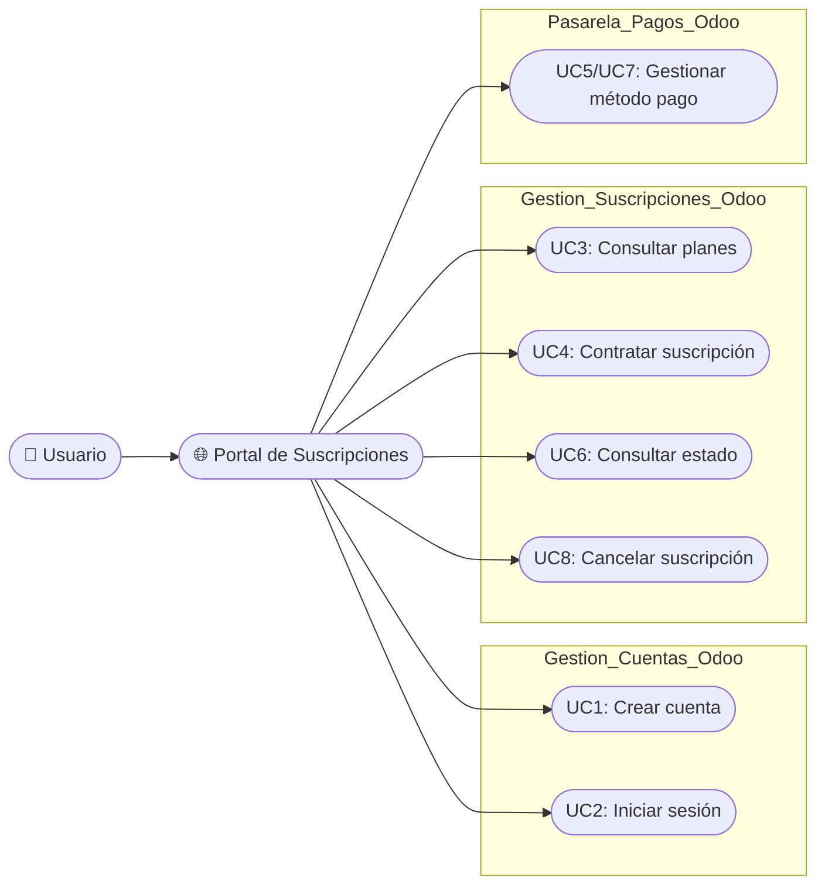
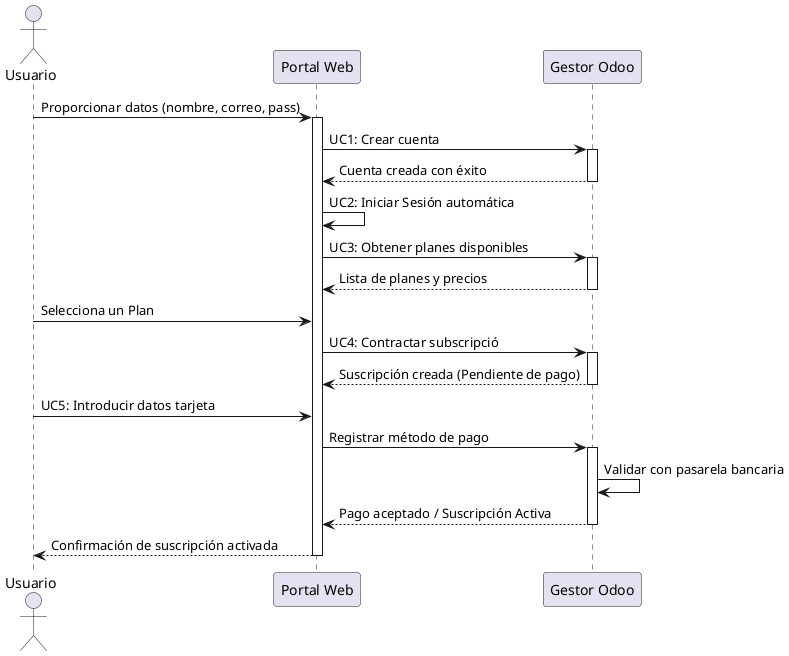
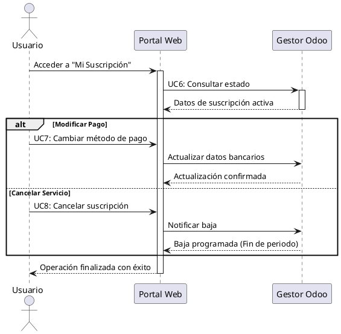

# Gestor suscripcions web
Portal web que gestiona las suscripciones

### Que hace ?
+ Registra nuevos ususarios en el sistema Odoo
+ Inicio de sesión y autenticación contra Odoo
+ Visualización pública selección y alta de los tipos de suscripciones y precios
+ Introducción y modificación de métodos de pago
+ Consulta del estado actual de la suscripción
+ Trámite para dar de baja el servicio

### Interacción
Según el diagrama, este componente interactúa con:
+ Login Odoo

### Endpoints

***Por definir***

## Casos de uso

## Diagramas de flujo

### Registro y Contratación

### Cambio de Método de Pago o Cancelación

