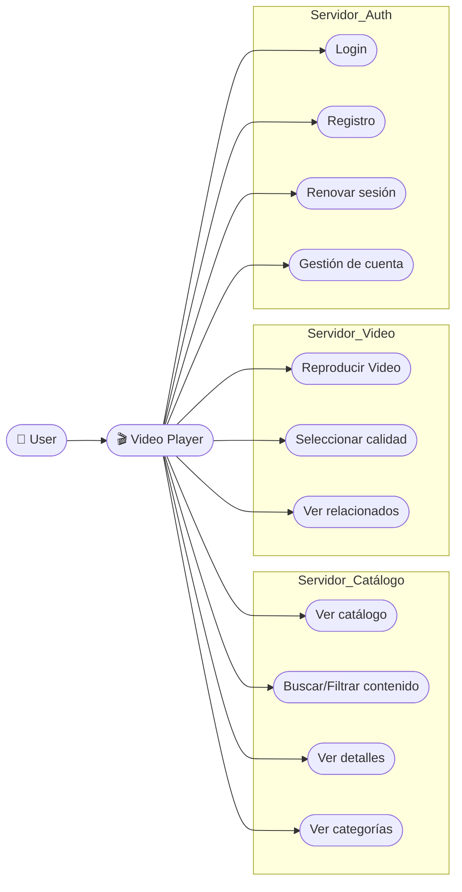
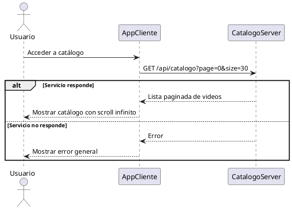
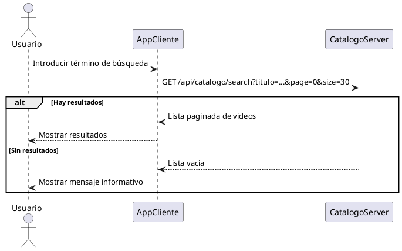
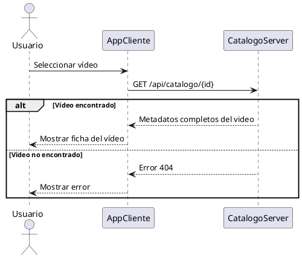
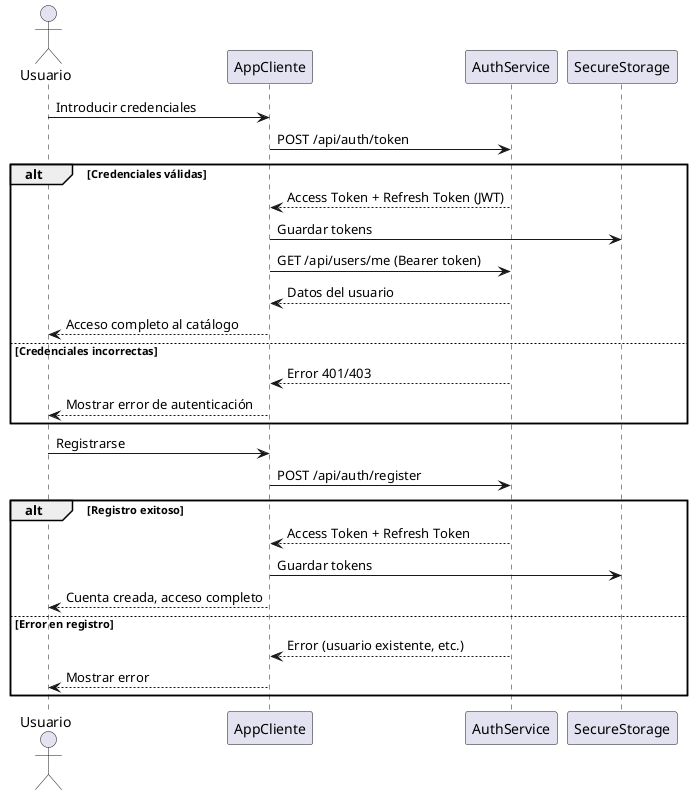
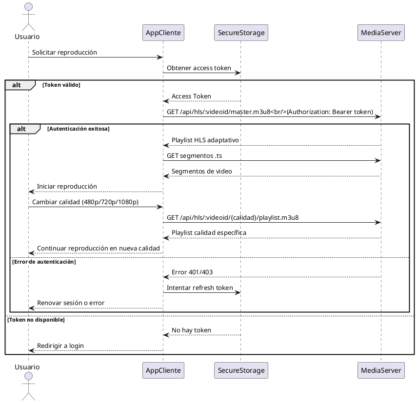
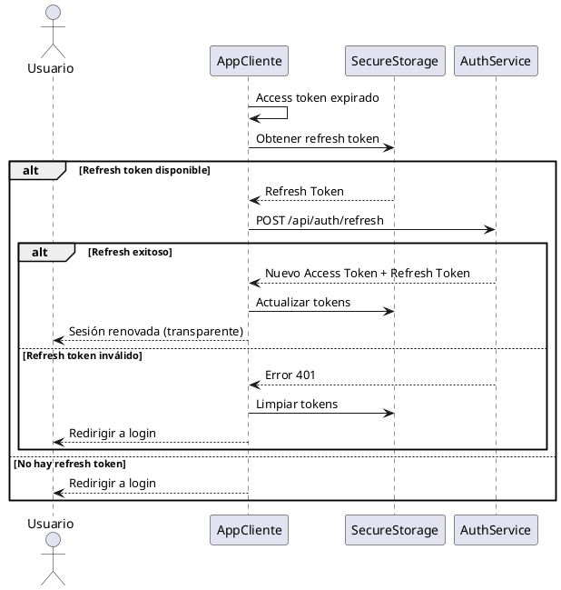
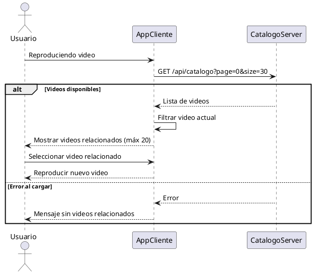
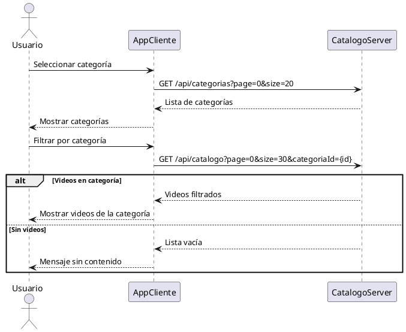

# Reproductor Móvil
Este es el reproductor principal de blosteflix, una app móvil multiplataforma desarrollada con Flutter para consultar el catálogo y reproducir contenido.

## Showcase
{ style="display: block; margin: 0 auto; width: 300px;" }

## Arquitectura

La aplicación está construida siguiendo los principios de **Clean Architecture**, dividida en tres capas principales:

- **Domain**: Entidades, repositorios abstractos y casos de uso
- **Infrastructure**: Implementación de repositorios, APIs y mappers de datos
- **Presentation**: Interfaces de usuario, providers de estado y servicios

### Tecnologías principales

+ **Flutter** (SDK 3.10.7+): Framework multiplataforma
+ **Riverpod**: Gestión de estado reactiva
+ **Chewie + Video Player**: Reproducción de video HLS
+ **Flutter Secure Storage**: Almacenamiento seguro de tokens
+ **HTTP**: Comunicación con APIs REST

### Que hace ?

+ Login y registro de usuarios con JWT
+ Autenticación con tokens de acceso y refresh
+ Muestra catálogo de videos con scroll infinito
+ Búsqueda y filtrado de contenido por categorías
+ Reproduce videos en formato HLS con selección de calidad (Auto, 480p, 720p, 1080p)
+ Visualización de videos relacionados
+ Gestión de cuenta de usuario

### Interacción
Este componente interactúa con:

+ **Catálogo Backend**: Gestión de videos y categorías
+ **Auth Backend**: Autenticación y gestión de usuarios
+ **Media Backend**: Streaming HLS de videos

### Endpoints

#### Endpoints de autenticación
+ `POST /api/auth/token`: Login de usuario (retorna access y refresh tokens)
+ `POST /api/auth/register`: Registro de nuevo usuario
+ `POST /api/auth/refresh`: Renovación de access token usando refresh token
+ `GET /api/users/me`: Obtener detalles del usuario autenticado (requiere Bearer token)

#### Endpoints catálogo
+ `GET /api/catalogo`: Recibe videos paginados (params: page, size, categoriaId opcional). La paginación es 0-indexed (page=0 para la primera página)
+ `GET /api/catalogo/search`: Búsqueda de videos por título (params: titulo, page, size). La paginación es 0-indexed
+ `GET /api/catalogo/:id`: Recibe detalles de un video específico
+ `GET /api/categorias`: Recibe categorías paginadas (params: page, size). La paginación es 0-indexed
+ `GET /api/categorias/:id`: Recibe una categoría específica

#### Endpoints video backend (Media Server)
Todos los endpoints de media requieren autenticación Bearer token en el header:
+ `GET /api/hls/:videoid/master.m3u8`: Playlist HLS adaptativo (Auto)
+ `GET /api/hls/:videoid/480/playlist.m3u8`: Playlist para calidad 480p
+ `GET /api/hls/:videoid/720/playlist.m3u8`: Playlist para calidad 720p
+ `GET /api/hls/:videoid/1080/playlist.m3u8`: Playlist para calidad 1080p
+ `GET /api/hls/:videoid/:segment.ts`: Recibe los segmentos de video para reproducción

## Casos de uso

### Diagramas de flujo

#### Explorar catálogo

#### Buscar contenidos

#### Consultar detalle de un video

#### Iniciar sesión / Registro

#### Reproducir video

#### Renovar token de acceso

#### Ver videos relacionados

#### Filtrar por categorías

