# Reproductor Móvil
Este es el reproductor principal de blosteflix una app móvil para consultar el catalogo y reproducir.

### Que hace ?

+ Login del usuario
+ Redirección a la pasarela de pagos
+ Muestra catálogo
+ Reproduce videos.

### Interacción
Este componente interactua con:

+ Catálogo backend
+ Video backend
+ Login Odoo

### Endpoints
Este reproductor gasta los siguientes endpoints TODOS en get
#### Endpoints catalogo
+ `api/catalogo`: recibe todo el catálogo
+ `api/catalogo/:categoria`: recibe las entradas de una categoria o tópico
+ `api/catalogo/:titulo`: recibe 1 unico titulo.
#### Endpoints video backend
+ `api/hls/:videoid`: recibe el mapa de los segmentos 
+ `api/hls/:videoid/:segment.ts`:recibe los segmentos para poder reproducirlos.

## Casos de uso

```mermaid
flowchart LR
    User([👤 User])
    Player([🎬 Video Player])

    subgraph Servidor_Catálogo
       VerCatalogo([Ver catálogo])
       Filtrar([Buscar/Filtrar contenido])
       Detalles([Ver detalles ])
    end

    subgraph Servidor_Video
        ReproducirVideo([Reproducir Video])
    end

    subgraph Login_Odoo_Web
        Login([Login])
        Suscribirse([Suscribirse])
    end

    User --> Player
    Player --> VerCatalogo
    Player --> ReproducirVideo
    Player --> Login
    Player --> Suscribirse
    Player --> Filtrar
    Player --> Detalles

```

### Diagramas de flujo

#### Explorar catálogo

```plantuml
@startuml
actor Usuario
participant AppCliente
participant CatalogoServer

Usuario -> AppCliente : Acceder a catálogo
AppCliente -> CatalogoServer : GET /catalogo/home
alt Servicio responde
    CatalogoServer --> AppCliente : Categorías, tendencias, recomendaciones
    AppCliente --> Usuario : Mostrar catálogo
else Servicio no responde
    CatalogoServer --> AppCliente : Error
    AppCliente --> Usuario : Mostrar error general
end
@enduml

```

#### Buscar contenidos

```plantuml
@startuml
actor Usuario
participant AppCliente
participant CatalogoServer

Usuario -> AppCliente : Introducir término de búsqueda
AppCliente -> CatalogoServer : GET /catalogo/search?q=...
alt Hay resultados
    CatalogoServer --> AppCliente : Lista de títulos
    AppCliente --> Usuario : Mostrar resultados
else Sin resultados
    CatalogoServer --> AppCliente : Lista vacía
    AppCliente --> Usuario : Mostrar mensaje informativo
end
@enduml

```

#### Consultar detalle de un video

```plantuml
@startuml
actor Usuario
participant AppCliente
participant CatalogoServer

Usuario -> AppCliente : Seleccionar vídeo
AppCliente -> CatalogoServer : GET /catalogo/videos/{id}
alt Vídeo encontrado
    CatalogoServer --> AppCliente : Metadatos completos
    AppCliente --> Usuario : Mostrar ficha del vídeo
else Vídeo no encontrado
    CatalogoServer --> AppCliente : Error 404
    AppCliente --> Usuario : Mostrar error
end
@enduml

```

#### Iniciar sesion / Validar suscripción

```plantuml

@startuml
actor Usuario
participant AppCliente
participant AuthService
participant Odoo

Usuario -> AppCliente : Introducir credenciales
AppCliente -> AuthService : Validar credenciales
alt Credenciales válidas
    AuthService --> AppCliente : Usuario autenticado
    AppCliente -> Odoo : Consultar estado de suscripción
    alt Suscripción activa
        Odoo --> AppCliente : Suscripción válida
        AppCliente --> Usuario : Acceso completo
    else Suscripción caducada
        Odoo --> AppCliente : Suscripción no válida
        AppCliente --> Usuario : Acceso limitado
    end
else Credenciales incorrectas
    AuthService --> AppCliente : Error autenticación
    AppCliente --> Usuario : Mostrar error
end
@enduml


```

#### Reproducir video

```plantuml
@startuml
actor Usuario
participant AppCliente
participant Odoo
participant CatalogoServer
participant MediaServer

Usuario -> AppCliente : Solicitar reproducción
AppCliente -> Odoo : Validar suscripción
alt Suscripción válida
    Odoo --> AppCliente : OK
    AppCliente -> CatalogoServer : Obtener URL HLS
    CatalogoServer --> AppCliente : URL manifest.m3u8
    AppCliente -> MediaServer : GET manifest.m3u8
    alt Segmentos disponibles
        MediaServer --> AppCliente : Segmentos HLS
        AppCliente --> Usuario : Iniciar reproducción
        AppCliente -> AppCliente : Guardar progreso
    else Error en segmentos
        MediaServer --> AppCliente : Error
        AppCliente --> Usuario : Error de reproducción
    end
else Suscripción no válida
    Odoo --> AppCliente : No autorizado
    AppCliente --> Usuario : Reproducción no permitida
end
@enduml

```

#### Gestionar Preferidos

```plantuml
@startuml
actor Usuario
participant AppCliente
participant CatalogoServer

Usuario -> AppCliente : Añadir / eliminar de lista
AppCliente -> CatalogoServer : PUT /usuario/listas
alt Actualización correcta
    CatalogoServer --> AppCliente : OK
    AppCliente --> Usuario : Mostrar lista actualizada
else Error de persistencia
    CatalogoServer --> AppCliente : Error
    AppCliente --> Usuario : Acción no guardada
end
@enduml
```

#### Continuar Visualización

```plantuml
@startuml
actor Usuario
participant AppCliente
participant CatalogoServer
participant MediaServer

Usuario -> AppCliente : Seleccionar vídeo comenzado
AppCliente -> CatalogoServer : Consultar progreso
alt Progreso disponible
    CatalogoServer --> AppCliente : Tiempo guardado
    AppCliente -> MediaServer : Reproducir desde punto guardado
    AppCliente --> Usuario : Reproducción continua
else Progreso no disponible
    CatalogoServer --> AppCliente : Sin progreso
    AppCliente -> MediaServer : Reproducir desde inicio
    AppCliente --> Usuario : Reproducción desde inicio
end
@enduml

```

