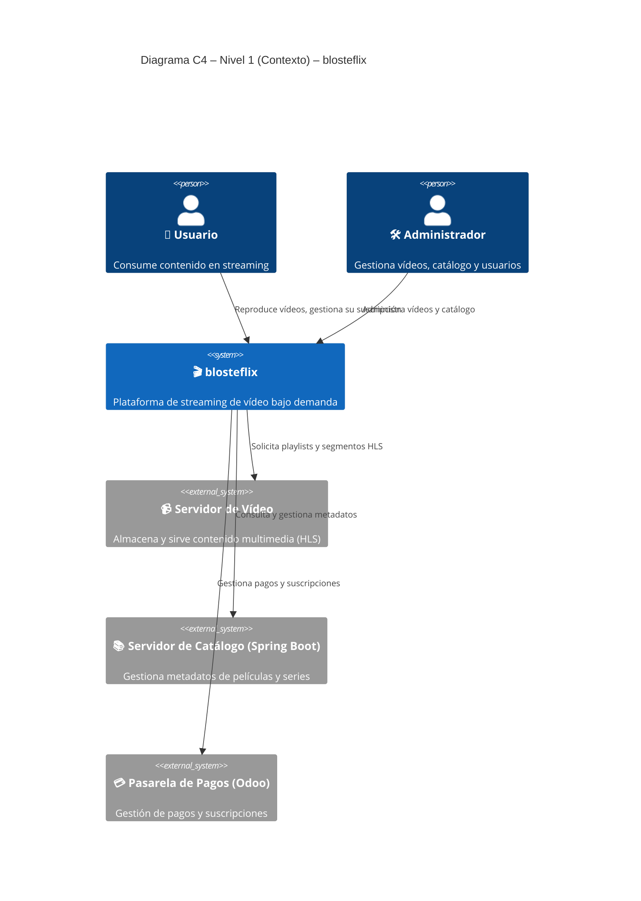
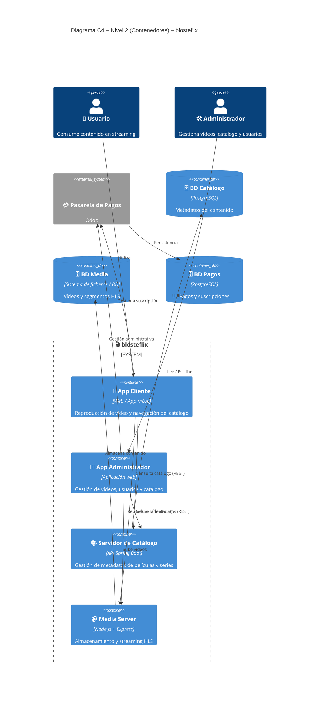
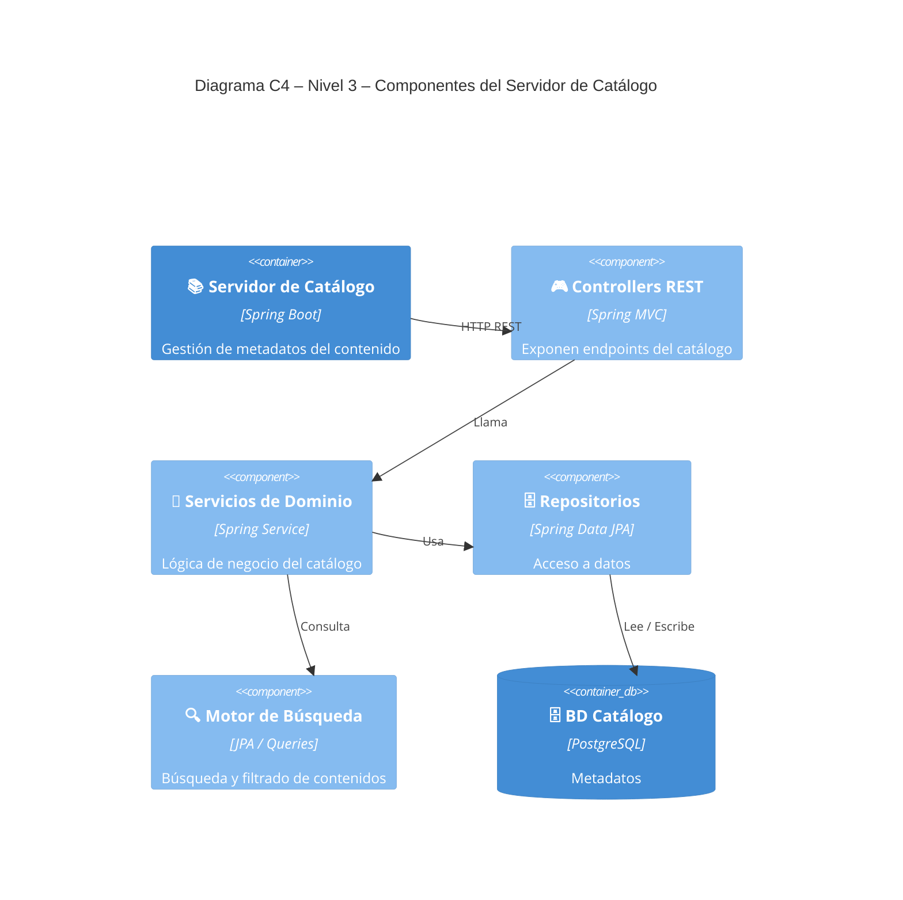
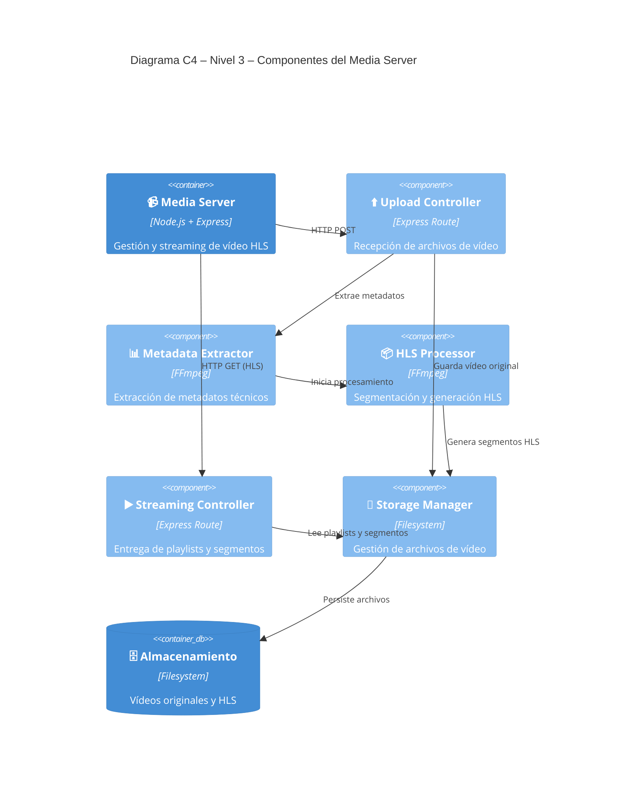

# Bienvenido a la documentacion de Blosteflix

Blosteflix es un proyecto de desarrollo de una app al estilo Netflix.
Esta formado por varios componentes cada uno con su responsabilidad, entre ellos tenemos:

+ Repoductor video, hecho en Flutter
+ Un gestor de los videos subidos a la plataforma, hecho en Vue
+ Un servidor API REST que muestra el catálogo, hecho en Spring
+ Un servidor de contenido HLS, hecho en hls
+ Y a futuro una pasarela de pagos administrada mediante Odoo.

## Diagrama C4

## Requisitos funcionales y no funcionales
### Requisitos funcionales
#### Funciones específicas
+ Se debe permitir a los usuarios registrarse con username y contraseña.
+ Se debe permitir a todos los usuarios registrados ver el catálogo.

+ Se debe subir el video a la base de datos cuando se confirma y estar disponible en el catálogo.
+ Se debe restringir que solo los administradores den de alta a nuevos administradores.
+ Se debe restingir que solo los usuarios accedan a la app reproductor y catálogo y que solo los administradores accedan a la app de administrador
+ Los permisos de los administradores se dividen en roles, permiso de videos y permiso de usuarios.

+ Se debe validar la subscripción del usuario con cada interacción relacionada con reproducir video.
+ Se debe cambiar el estado de la subscripción del usuario cuando haga una modificación en su subscripción.
+ Se debe permitir el pago con targeta.

#### Reglas de negocio
+ Al clicar en una portada del catálogo que debe llevar una página con el video con los detalles del video.
+ Al clicar en el play de un video debe mostrar las opciones, pantalla completa, parar el video, barra de duración.
+ El titulo de la barra de navegación debe mostrar el catálogo.
+ El botón categorías debe abrir un desplegable con todos los tipos de video y al clicar en uno mostrarte un catálogo con solo los videos que contengan esa categoría.
+ Al hacer clic en buscar debe aparecer una barra buscadora que busque por título o por fragmento de título.

### Requisitos no funcionales

+ Rendimiento, que cargue el video en menos de 5 segundos.
+ Escalabilidad, el código y la base de datos puedan crecer al ritmo de la aplicación de manera fácil.
+ Seguridad Básica, que todo el tráfico sea a través del protocolo HTTPS, que las contraseñas encriptadas en la base de datos y un sistema de login seguro con tokens que expiran.
+ Compatibilidad, que sea compatible en diferentes navegadores y SO de móviles.