# Bienvenido a la documentacion de Blosteflix

Blosteflix es un proyecto de desarrollo de una app al estilo Netflix.
Esta formado por varios componentes cada uno con su responsabilidad, entre ellos tenemos:

+ Repoductor video, hecho en Flutter
+ Un gestor de los videos subidos a la plataforma, hecho en Vue
+ Un servidor API REST que muestra el catálogo, hecho en Spring
+ Un servidor de contenido HLS, hecho en hls
+ Y a futuro una pasarela de pagos administrada mediante Odoo.

## Diagrama C4

```mermaid
C4Context
title Diagrama C4 – Nivel 1 (Contexto) – blosteflix

Person(usuario, "👤 Usuario", "Consume contenido en streaming")
Person(admin, "🛠️ Administrador", "Gestiona vídeos, catálogo y usuarios")

System(blosteflix, "🎬 blosteflix", "Plataforma de streaming de vídeo bajo demanda")

System_Ext(videoServer, "📹 Servidor de Vídeo", "Almacena y sirve contenido multimedia (HLS)")
System_Ext(catalogo, "📚 Servidor de Catálogo (Spring Boot)", "Gestiona metadatos de películas y series")
System_Ext(pagos, "💳 Pasarela de Pagos (Odoo)", "Gestión de pagos y suscripciones")

Rel(usuario, blosteflix, "Reproduce vídeos, gestiona su suscripción")
Rel(admin, blosteflix, "Administra vídeos y catálogo")

Rel(blosteflix, videoServer, "Solicita playlists y segmentos HLS")
Rel(blosteflix, catalogo, "Consulta y gestiona metadatos")
Rel(blosteflix, pagos, "Gestiona pagos y suscripciones")
```

```mermaid
C4Component
title Diagrama C4 – Nivel 3 – Componentes del Media Server

Container(mediaServer, "📹 Media Server", "Node.js + Express", "Gestión y streaming de vídeo HLS")

Component(upload, "⬆️ Upload Controller", "Express Route", "Recepción de archivos de vídeo")
Component(metadata, "📊 Metadata Extractor", "FFmpeg", "Extracción de metadatos técnicos")
Component(hls, "📦 HLS Processor", "FFmpeg", "Segmentación y generación HLS")
Component(stream, "▶️ Streaming Controller", "Express Route", "Entrega de playlists y segmentos")
Component(storage, "💾 Storage Manager", "Filesystem", "Gestión de archivos de vídeo")

ContainerDb(fs, "🗄️ Almacenamiento", "Filesystem", "Vídeos originales y HLS")

Rel(upload, metadata, "Extrae metadatos")
Rel(upload, storage, "Guarda vídeo original")
Rel(metadata, hls, "Inicia procesamiento")
Rel(hls, storage, "Genera segmentos HLS")
Rel(stream, storage, "Lee playlists y segmentos")
Rel(storage, fs, "Persiste archivos")

Rel_U(mediaServer, upload, "HTTP POST")
Rel_U(mediaServer, stream, "HTTP GET (HLS)")

```

## Requisitos funcionales y no funcionales
### Requisitos funcionales
#### Funciones específicas
+ Se debe permitir a los usuarios registrarse con username y contraseña.
+ Se debe permitir a todos los usuarios registrados ver el catálogo.

+ Se debe subir el video a la base de datos cuando se confirma y estar disponible en el catálogo.
+ Se debe restringir que solo los administradores den de alta a nuevos administradores.
+ Se debe restingir que solo los usuarios accedan a la app reproductor y catálogo y que solo los administradores accedan a la app de administrador
+ Los permisos de los administradores se dividen en roles, permiso de videos y permiso de usuarios.

+ Se debe validar la subscripción del usuario con cada interacción relacionada con reproducir video.
+ Se debe cambiar el estado de la subscripción del usuario cuando haga una modificación en su subscripción.
+ Se debe permitir el pago con targeta.

#### Reglas de negocio
+ Al clicar en una portada del catálogo que debe llevar una página con el video con los detalles del video.
+ Al clicar en el play de un video debe mostrar las opciones, pantalla completa, parar el video, barra de duración.
+ El titulo de la barra de navegación debe mostrar el catálogo.
+ El botón categorías debe abrir un desplegable con todos los tipos de video y al clicar en uno mostrarte un catálogo con solo los videos que contengan esa categoría.
+ Al hacer clic en buscar debe aparecer una barra buscadora que busque por título o por fragmento de título.

### Requisitos no funcionales

+ Rendimiento, que cargue el video en menos de 5 segundos.
+ Escalabilidad, el código y la base de datos puedan crecer al ritmo de la aplicación de manera fácil.
+ Seguridad Básica, que todo el tráfico sea a través del protocolo HTTPS, que las contraseñas encriptadas en la base de datos y un sistema de login seguro con tokens que expiran.
+ Compatibilidad, que sea compatible en diferentes navegadores y SO de móviles.