# Pasarela pagos

### Descripción
Servidor de Odoo para gestionar usuarios, suscripciones y metodos de pago 

### Responsabilidades
+ Crear y enviar tokens de seguridad para la interacción entre servicios
+ Gestionar altas, bajas, suspensiones y edición de perfiles
+ Validar métodos de pago y gestionar la información de tarjetas o cuentas asociadas a los usuarios
+ Registrar nuevos usuarios, autenticar credenciales y manejar el inicio de sesión para distintos roles
+ Crear, modificar y renovar planes de suscripción tanto desde la perspectiva del cliente como del administrador

### Interacion
Este componente interactua con:
+ Admin App
+ Video Player
+ Portal web

## Endpoints

## Diagrama E-R

## Casos de uso

```mermaid
flowchart LR

    Usuario[👤 Usuario]
    Admin[🛠️ Administrador]
    subgraph Sistema Suscripciones
        UC1(Registrarse)
        UC2(Gestionar Método de Pago)
        UC3(Gestionar Suscripción)
        UC4(Iniciar Sesión)
        UC5(Gestionar Usuarios)
        UC6(Gestionar Roles)
        UC7(Gestionar Suscripciones)
        UC8(Asignar Roles a 
        Administradores)
    end

    Usuario --> UC1
    Usuario --> UC2
    Usuario --> UC3
    Usuario --> UC4

    Admin --> UC4
    Admin --> UC5
    Admin --> UC6
    Admin --> UC7
    Admin --> UC8
```

## Diagramas de flujo

### Autenticación y Generación de Token

```plantuml
@startuml
actor Actor
participant PasarelaPagos
participant DB_Odoo

Actor -> PasarelaPagos : POST /api/auth/login\n(user, password)
activate PasarelaPagos

PasarelaPagos -> DB_Odoo : Buscar Persona por username
activate DB_Odoo
DB_Odoo --> PasarelaPagos : Datos Persona (hash_password, rol)
deactivate DB_Odoo

PasarelaPagos -> PasarelaPagos : Validar password
PasarelaPagos -> PasarelaPagos : Generar Token de Seguridad (JWT)

alt Credenciales válidas
    PasarelaPagos --> Actor : 200 OK (Token + Rol)
else Credenciales incorrectas
    PasarelaPagos --> Actor : 401 Unauthorized
else Cuenta suspendida
    PasarelaPagos --> Actor : 403 Forbidden
end

deactivate PasarelaPagos
@enduml
```

### Gestión de Suscripción y Pago
