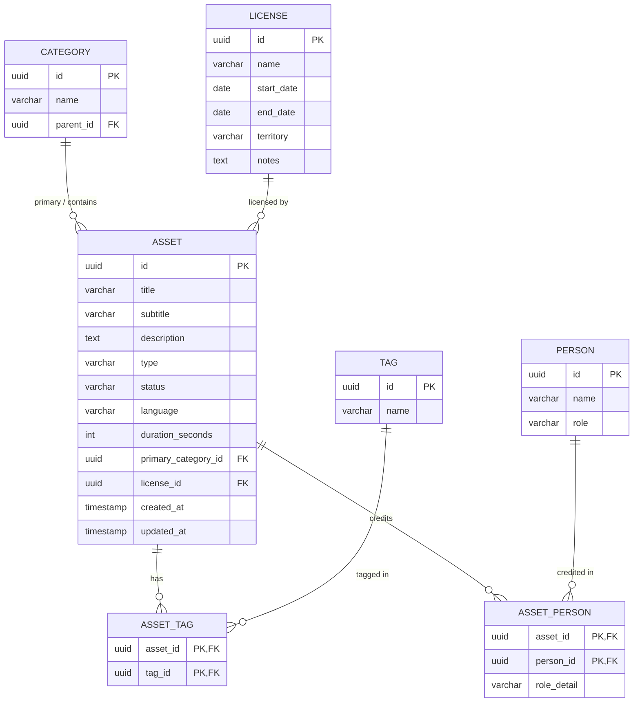
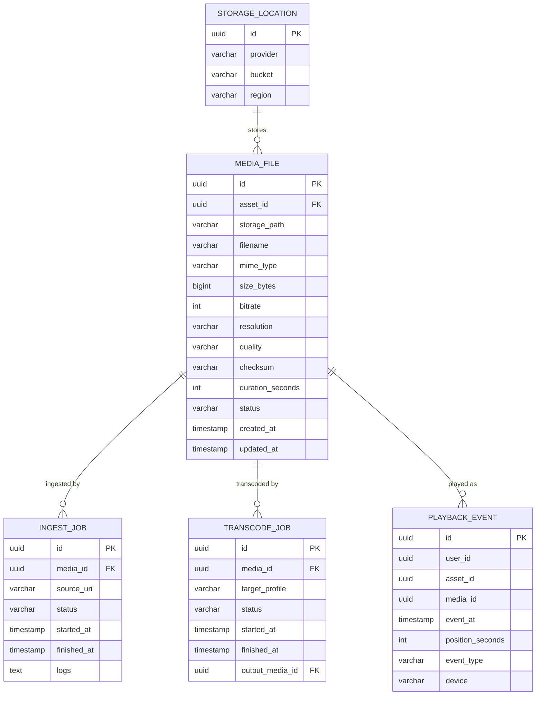
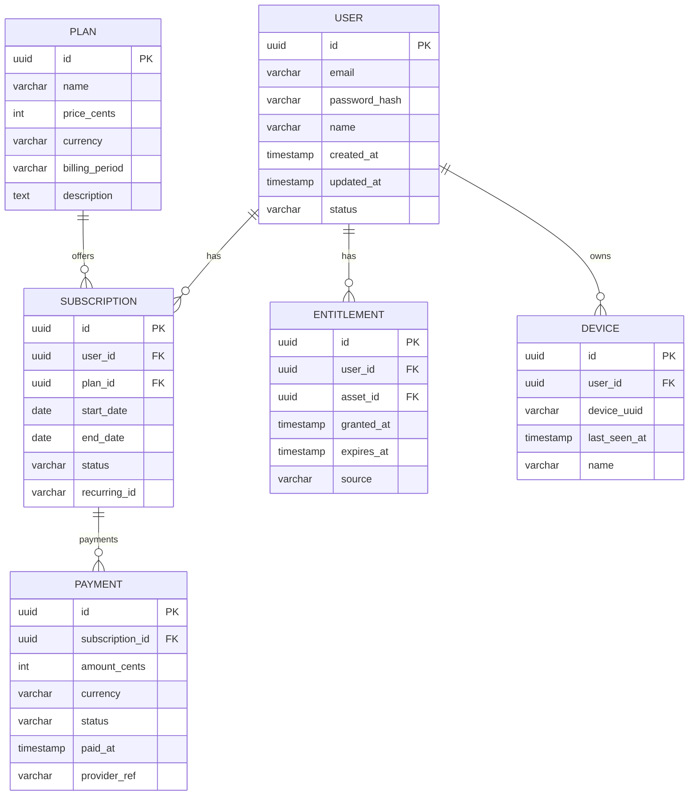
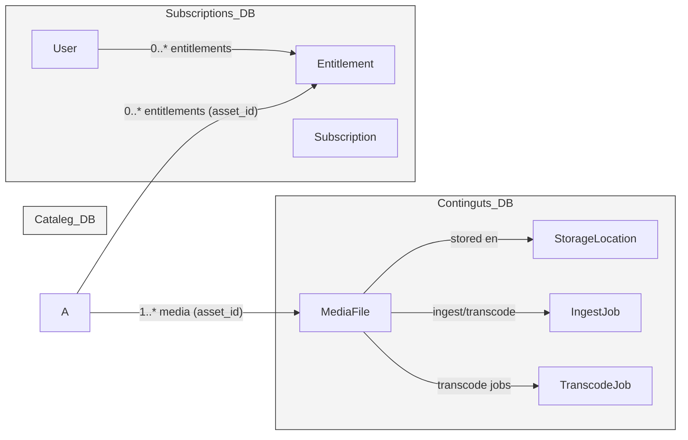

```mermaid
erDiagram
    ASSET {
        uuid id PK
        varchar title
        varchar subtitle
        text description
        varchar type
        varchar status
        varchar language
        int duration_seconds
        uuid primary_category_id FK
        uuid license_id FK
        timestamp created_at
        timestamp updated_at
    }

    CATEGORY {
        uuid id PK
        varchar name
        uuid parent_id FK
    }

    TAG {
        uuid id PK
        varchar name
    }

    ASSET_TAG {
        uuid asset_id PK,FK
        uuid tag_id PK,FK
    }

    PERSON {
        uuid id PK
        varchar name
        varchar role
    }

    ASSET_PERSON {
        uuid asset_id PK,FK
        uuid person_id PK,FK
        varchar role_detail
    }

    LICENSE {
        uuid id PK
        varchar name
        date start_date
        date end_date
        varchar territory
        text notes
    }

    CATEGORY ||--o{ ASSET : "primary / contains"
    ASSET ||--o{ ASSET_TAG : "has"
    TAG ||--o{ ASSET_TAG : "tagged in"
    ASSET ||--o{ ASSET_PERSON : "credits"
    PERSON ||--o{ ASSET_PERSON : "credited in"
    LICENSE ||--o{ ASSET : "licensed by"
```

---

```mermaid
erDiagram
    MEDIA_FILE {
        uuid id PK
        uuid asset_id FK
        varchar storage_path
        varchar filename
        varchar mime_type
        bigint size_bytes
        int bitrate
        varchar resolution
        varchar quality
        varchar checksum
        int duration_seconds
        varchar status
        timestamp created_at
        timestamp updated_at
    }

    INGEST_JOB {
        uuid id PK
        uuid media_id FK
        varchar source_uri
        varchar status
        timestamp started_at
        timestamp finished_at
        text logs
    }

    TRANSCODE_JOB {
        uuid id PK
        uuid media_id FK
        varchar target_profile
        varchar status
        timestamp started_at
        timestamp finished_at
        uuid output_media_id FK
    }

    STORAGE_LOCATION {
        uuid id PK
        varchar provider
        varchar bucket
        varchar region
    }

    PLAYBACK_EVENT {
        uuid id PK
        uuid user_id
        uuid asset_id
        uuid media_id
        timestamp event_at
        int position_seconds
        varchar event_type
        varchar device
    }

    STORAGE_LOCATION ||--o{ MEDIA_FILE : "stores"
    MEDIA_FILE ||--o{ INGEST_JOB : "ingested by"
    MEDIA_FILE ||--o{ TRANSCODE_JOB : "transcoded by"
    MEDIA_FILE ||--o{ PLAYBACK_EVENT : "played as"
```

---

```mermaid
erDiagram
    "USER" {
        uuid id PK
        varchar email
        varchar password_hash
        varchar name
        timestamp created_at
        timestamp updated_at
        varchar status
    }

    PLAN {
        uuid id PK
        varchar name
        int price_cents
        varchar currency
        varchar billing_period
        text description
    }

    SUBSCRIPTION {
        uuid id PK
        uuid user_id FK
        uuid plan_id FK
        date start_date
        date end_date
        varchar status
        varchar recurring_id
    }

    ENTITLEMENT {
        uuid id PK
        uuid user_id FK
        uuid asset_id FK
        timestamp granted_at
        timestamp expires_at
        varchar source
    }

    PAYMENT {
        uuid id PK
        uuid subscription_id FK
        int amount_cents
        varchar currency
        varchar status
        timestamp paid_at
        varchar provider_ref
    }

    DEVICE {
        uuid id PK
        uuid user_id FK
        varchar device_uuid
        timestamp last_seen_at
        varchar name
    }

    "USER" ||--o{ SUBSCRIPTION : "has"
    PLAN ||--o{ SUBSCRIPTION : "offers"
    "USER" ||--o{ ENTITLEMENT : "has"
    SUBSCRIPTION ||--o{ PAYMENT : "payments"
    "USER" ||--o{ DEVICE : "owns"
```

---

```mermaid
graph LR
    subgraph Cataleg_DB
    end

    subgraph Continguts_DB
        M[MediaFile]
        S[StorageLocation]
        I[IngestJob]
        T[TranscodeJob]
    end

    subgraph Subscriptions_DB
        U[User]
        E[Entitlement]
        Sub[Subscription]
    end

    A -- "1..* media (asset_id)" --> M
    M -- "stored en" --> S
    M -- "ingest/transcode" --> I
    M -- "transcode jobs" --> T

    U -- "0..* entitlements" --> E
    A -- "0..* entitlements (asset_id)" --> E

    click A "#note" "Catàleg contiene metadata; IDs (uuid) referenciados por otros servicios"
    classDef dbs fill:#f4f4f4,stroke:#333,stroke-width:1px;
    class Cataleg_DB,Continguts_DB,Subscriptions_DB dbs

    %% Nota: las FK cross-db se mantienen como uuid y se validan por API/eventos.
```

---

```mermaid

```

---

```mermaid

```