# Documentación del servidor HLS de videos.

### Descripción
Servidor express encargado de servir los videos mediante HLS.

### Responsabilidades
+ Comprobar suscripciones
+ Reproducir videos 
+ Guardar y procesar videos

### Interacion
Este componente interactua con:
+ Video Player
+ Admin App
+ Suscripciones odoo (sin implementar)

## Endpoints
### Endpoints GET
+ `api/hls/:videoid` : Envia el mapa hls para que el cliente pueda reproducir

+ `api/hls/:videoid/:segment.ts` : Envia los segmentos del video  al cliente
### Endpoints POST
`api/videoserver/upload` : Recibe un video en bruto, devuelve los metadatos técnicos (duracion, resolucion, codec, bitrate, fps, tamaño, audio tracks)

## Casos de uso

```mermaid
flowchart LR
    Player([🎬 Video Player])
    Admin([👤 Admin App ])

    subgraph Servidor_HLS
        DescargarSegmentos((Descargar segmentos))
        SubirVideo((Subir video original))
    end

    Player --> DescargarSegmentos
    Admin --> SubirVideo

```

## Diagramas de flujo

### Reproducir video

```plantuml
@startuml
participant VideoReproductor
participant VideoServer

VideoReproductor -> VideoServer : GET /api/hls/:id
activate VideoServer

VideoServer -> VideoServer : Validar token
VideoServer -> VideoServer : Comprobar vídeo disponible
VideoServer --> VideoReproductor : master.m3u8
alt Acceso no valido o vídeo no disponible
else Acceso inválido
    VideoServer --> VideoReproductor : 401 Unauthorized
else Vídeo no disponible
    VideoServer --> VideoReproductor : 404 Not Found
end

deactivate VideoServer

VideoReproductor -> VideoServer : GET /api/hls/:id/:segment
activate VideoServer

VideoServer -> VideoServer : Validar token
VideoServer -> VideoServer : Comprobar segmento existe

alt Segmento válido
    VideoServer --> VideoReproductor : Segmento .ts
else Segmento no encontrado
    VideoServer --> VideoReproductor : 404 Not Found
end

deactivate VideoServer
@enduml
```

### Subir video

```plantuml
@startuml
actor GestorWeb
participant VideoServer
participant CatalogoServer

GestorWeb -> VideoServer : POST /api/videos (archivo de vídeo)
VideoServer -> VideoServer : Validar formato
VideoServer -> VideoServer : Extraer metadatos técnicos
VideoServer -> VideoServer : Trocear vídeo,
VideoServer --> GestorWeb : Metadatos técnicos\n(duración, resolución, codec)

GestorWeb -> GestorWeb : Añadir metadatos de negocio\n(título, descripción, categoría)

GestorWeb -> CatalogoServer : POST /api/catalogo/videos\n(metadatos completos)
CatalogoServer -> CatalogoServer : Guardar información del vídeo
CatalogoServer --> GestorWeb : Confirmación de registro
@enduml
```
