# Documentación del servidor HLS de videos.

### Descripción
Servidor express encargado de servir los videos mediante HLS.

### Responsabilidades
Reproducir videos 
Gestionar subida de videos

### Interacion
Este componente interactua con:
+ Video Player
+ Admin App

## Endpoints
### Endpoints GET
`api/hls/:videoid` : Envia los videos en formato hls para que el cliente pueda reproducir
### Endpoints POST
`api/videoserver/upload` : Recibe un video en bruto, devuelve los metadatos técnicos (duracion, resolucion, codec, bitrate, fps, tamaño, audio tracks)

## Casos de uso

```mermaid
flowchart LR
    Player([🎬 Video Player])
    Admin([👤 Admin App ])

    subgraph Servidor_HLS
        DescargarSegmentos((Descargar segmentos))
        SubirVideo((Subir video original))
    end

    Player --> DescargarSegmentos
    Admin --> SubirVideo

```

