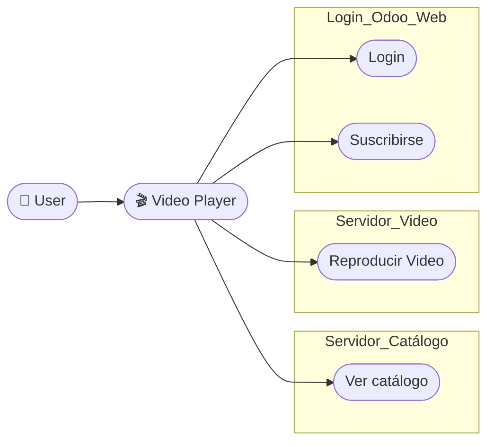

# Reproductor Móvil
Este es el reproductor principal de blosteflix una app móvil para consultar el catalogo y reproducir.

### Que hace ?
+ Login del usuario
+ Redirección a la pasarela de pagos
+ Muestra catálogo
+ Reproduce videos.

### Interacción
Este componente interactua con:
+ Catálogo backend
+ Video backend
+ Login Odoo

### Endpoints
Este reproductor gasta los siguientes endpoints TODOS en get
#### Endpoints catalogo
+ `api/catalogo`: recibe todo el catálogo
+ `api/catalogo/:categoria`: recibe las entradas de una categoria o tópico
+ `api/catalogo/:titulo`: recibe 1 unico titulo ??? coment: No tiene sentido, esto se va para review xd
#### Endpoints video backend
+ `api/hls/:videoid`: recibe el mapa de los segmentos 
+ `api/hls/:videoid/:segment.ts`:recibe los segmentos para poder reproducirlos.

## Casos de uso

